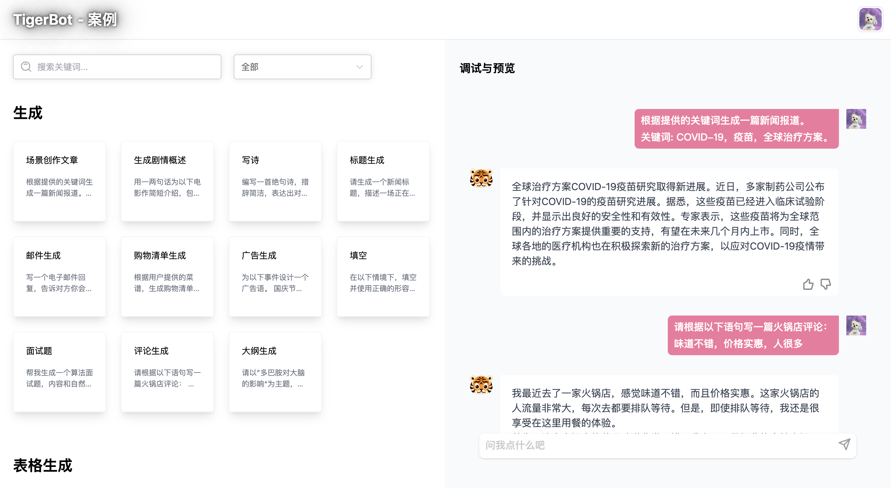
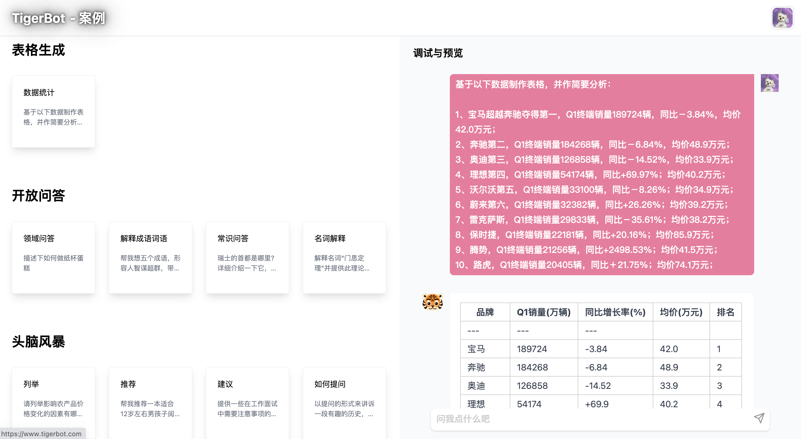
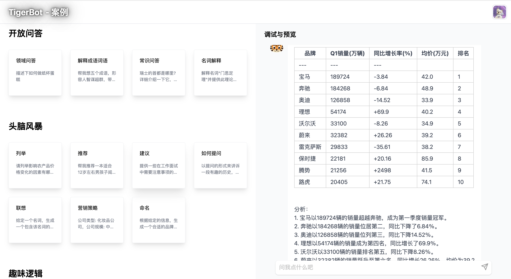
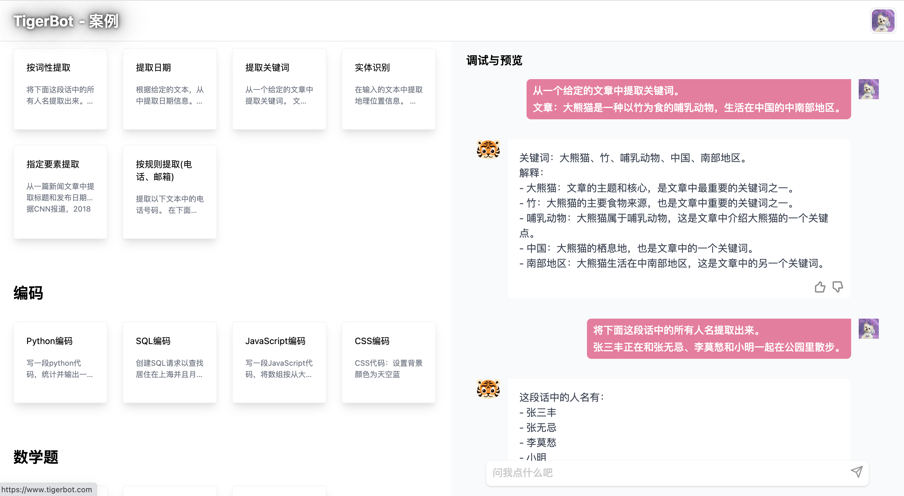
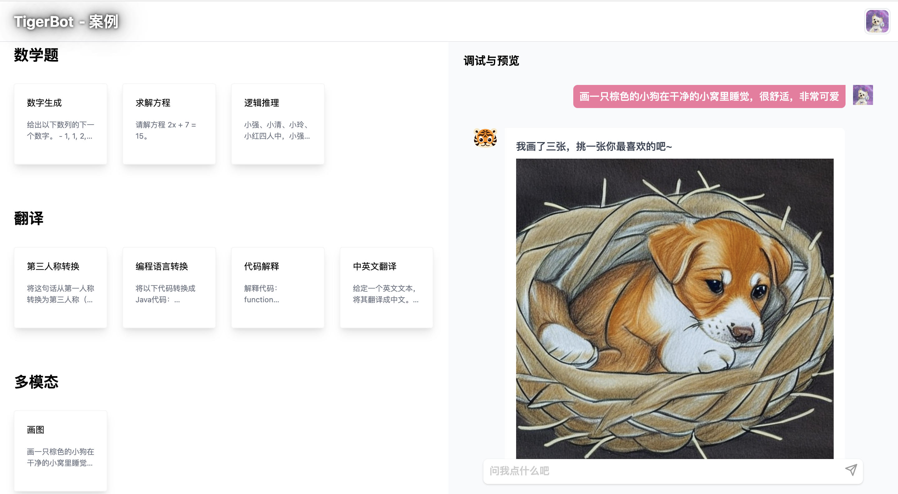

# TigerBot

<p align="center" width="100%">
</a>
</p>

## 最近更新

## 目录

- [环境安装](#环境安装)
- [模型下载](#模型下载)
- [训练和推理](#训练和推理)
- [开源数据集](#开源数据集)
- [测评](#测评)
- [API](#API)
- [案例](#案例)
- [平台](#平台)

## 环境安装

```bash

conda create --name tigerbot python=3.8
conda activate tigerbot
conda install pytorch torchvision torchaudio pytorch-cuda=11.7 -c pytorch -c nvidia

git clone https://github.com/TigerResearch/TigerBot
cd TigerBot
pip install -r requirements.txt
```

## 模型下载

<summary>Tigerbot-7B</summary>

| Tigerbot-7B                                    | Bits | memory(GB) |
| ---------------------------------------------- | ---- | ---------- |
| [Tigerbot-7B-base](https://huggingface.co)     | 16   | 17.2       |
| [Tigerbot-7B-sft](https://huggingface.co)      | 16   | 17.2       |
| [Tigerbot-7B-sft-int4](https://huggingface.co) | 4    | 8.5        |

<summary>Tigerbot-176B)</summary>

| Tigerbot-176B                                    | Bits | memory(GB) |
| ------------------------------------------------ | ---- | ---------- |
| [Tigerbot-176B-sft](https://huggingface.co)      | 16   | 347.6      |
| [Tigerbot-176B-sft-int4](https://huggingface.co) | 4    | 108.5      |

## 训练和推理

### 预训练

启动训练前安装 DeepSpeed

```
git clone https://github.com/microsoft/DeepSpeed/
cd DeepSpeed
rm -rf build
TORCH_CUDA_ARCH_LIST="8.0" DS_BUILD_CPU_ADAM=1 DS_BUILD_UTILS=1 pip install . \
--global-option="build_ext" --global-option="-j8" --no-cache -v \
--disable-pip-version-check 2>&1 | tee build.log
```

TORCH_CUDA_ARCH_LIST 根据你运行的 GPU 架构做调整，获取 TORCH_CUDA_ARCH_LIST

```
CUDA_VISIBLE_DEVICES=0 python -c "import torch; print(torch.cuda.get_device_capability())"
```

如果返回的结果是(8, 0)，那么 TORCH_CUDA_ARCH_LIST="8.0"

#### 启动训练

```
deepspeed \
--include="localhost:0,1,2,3" \
./train_clm.py \
--deepspeed ./ds_config/ds_config_zero3.json \
--model_name_or_path ./tigerbot_560m \
--dataset_name TigerResearch/dev_pretrain \
--do_train \
--output_dir ./ckpt-clm \
--overwrite_output_dir \
--preprocess_num_workers 8 \
--num_train_epochs 5 \
--learning_rate 1e-5 \
--evaluation_strategy steps \
--eval_steps 10 \
--bf16 True \
--save_strategy steps \
--save_steps 10 \
--save_total_limit 2 \
--logging_steps 10 \
--tf32 True \
--per_device_train_batch_size 2 \
--per_device_eval_batch_size 2
```

### 微调

#### 启动训练

```
deepspeed \
--include="localhost:0,1,2,3" \
./train_sft.py \
--deepspeed ./ds_config/ds_config_zero3.json \
--model_name_or_path ./tigerbot_560m \
--dataset_name TigerResearch/dev_sft \
--do_train \
--output_dir ./ckpt-sft \
--overwrite_output_dir \
--preprocess_num_workers 8 \
--num_train_epochs 5 \
--learning_rate 1e-5 \
--evaluation_strategy steps \
--eval_steps 10 \
--bf16 True \
--save_strategy steps \
--save_steps 10 \
--save_total_limit 2 \
--logging_steps 10 \
--tf32 True \
--per_device_train_batch_size 2 \
--per_device_eval_batch_size 2
```

### 推理

#### 单卡推理

```
CUDA_VISIBLE_DEVICES=0 python infer.py --model_path ${MODEL_DIR}
```

#### 多卡推理

```
CUDA_VISIBLE_DEVICES=0,1,2,3 python infer.py --model_path ${MODEL_DIR}
```

### 量化

我们使用[GPTQ](https://github.com/IST-DASLab/gptq)算法和[GPTQ-for-LLaMa](https://github.com/qwopqwop200/GPTQ-for-LLaMa)实现量化：

切换到 gptq 目录

```
cd gptq
```

#### 模型量化

```
CUDA_VISIBLE_DEVICES=0 python tigerbot.py ${MODEL_DIR} c4 --wbits 4 --act-order --groupsize 128 --save tigerbot-4bit-128g.pt
```

#### 量化模型单卡推理

```
CUDA_VISIBLE_DEVICES=0 python tigerbot_infer.py ${MODEL_DIR} --wbits 4 --groupsize 128 --load tigerbot-4bit-128g.pt
```

#### 量化模型多卡推理

```
CUDA_VISIBLE_DEVICES=0,1 python tigerbot_infer.py ${MODEL_DIR} --wbits 4 --groupsize 128 --load tigerbot-4bit-128g.pt
```

## 开源数据集

### 预训练数据

- <a href=https://huggingface.co/datasets/TigerResearch/pretrain_zh>中文开源预训练集 - 55G，包含中文书籍、中文互联网、中文百科 [hugging face]</a>
- <a href=https://huggingface.co/datasets/TigerResearch/pretrain_en>英文开源预训练集 - 51G，包含英文书籍、英文互联网、英文百科 [hugging face]</a>

  | 类型       | 磁盘占用 | 来源 |
  | ---------- | -------- | ---- |
  | 中文书籍   | 12G      | 自研 |
  | 中文互联网 | 25G      | 自研 |
  | 中文百科   | 19G      | 自研 |
  | 英文书籍   | 22G      | 开源 |
  | 英文互联网 | 6.9G     | 开源 |
  | 英文百科   | 22G      | 开源 |
  | **总量**   | **105G** |      |

- 完整预训练数据占比如图所示:

<p align="center" width="100%">
</a>
</p>


- 中文书籍及代码细分:

<p width="100%">
    
</p>

### 微调数据

#### 数据搜集

- 模型中使用的微调数据的搜集思想如下：

  a. 参考 Alpaca,扩充中英文 seed_tasks,增加一些中文习惯种子问题，基于此生成 2m 中文(本次开源 0.5m)及 0.1m(本次开源 50k)

  b. 基于人工写题及答案、网络搜集方式，整理加工问答集数据，在开源列表中标识为[自研]部分，本次开放部分数据

  c. 基于各类公开数据集转换清洗，其中[自研*]部分，表示基于原始数据进行二次开发后得到，[开源]部分数据集一般原始数据即为较规整的问答数据，进行简单清洗得到

#### 数据开源

- 指令数据集, 当前开源 120W 问答对，磁盘空间 1.1G (数据集开放到 huggingface）

  | 类型         | 语言 | 数据集                                                                                                                           | 数量        | 来源   |
  | ------------ | ---- | -------------------------------------------------------------------------------------------------------------------------------- | ----------- | ------ |
  | alpaca 中文  | 中文 | [tigerbot-alpaca-zh-0.5m](https://huggingface.co/datasets/TigerResearch/tigerbot-alpaca-zh-0.5m)                                 | 0.5m        | 自研   |
  | 百科问答     | 中文 | [tigerbot-wiki-qa-1k](https://huggingface.co/datasets/TigerResearch/tigerbot-wiki-qa-zh-1k)                                      | 1k          | 自研   |
  | 名著问答     | 中文 | [tigerbot-book-qa-1k](https://huggingface.co/datasets/TigerResearch/tigerbot-book-qa-1k)                                         | 1k          | 自研   |
  | 猜谜语       | 中文 | [tigerbot-riddle-qa-1k](https://huggingface.co/datasets/TigerResearch/tigerbot-riddle-qa-1k)                                     | 1k          | 自研   |
  | 阅读理解     | 中文 | [tigerbot-superclue-c3-zh-5k](https://huggingface.co/datasets/TigerResearch/tigerbot-superclue-c3-zh-5k)                         | 5k          | 自研\* |
  | 问答         | 中文 | [tigerbot-HC3-zh-12k](https://huggingface.co/datasets/TigerResearch/tigerbot-HC3-zh-12k)                                         | 12k         | 开源   |
  | 知乎问答     | 中文 | [tigerbot-zhihu-zh-10k](https://huggingface.co/datasets/TigerResearch/tigerbot-zhihu-zh-10k)                                     | 10k         | 开源   |
  | alpaca 英文  | 英文 | [tigerbot-alpaca-en-50k](https://huggingface.co/datasets/TigerResearch/tigerbot-alpaca-en-50k)                                   | 50k         | 自研   |
  | 头脑风暴     | 英文 | [tigerbot-dolly-Brainstorming-en-1.7k](https://huggingface.co/datasets/TigerResearch/tigerbot-dolly-Brainstorming-en-1.7k)       | 1.7k        | 开源   |
  | 分类         | 英文 | [tigerbot-dolly-Classification-en-2k](https://huggingface.co/datasets/TigerResearch/tigerbot-dolly-Classification-en-2k)         | 2k          | 开源   |
  | 数学问题     | 英文 | [tigerbot-gsm-8k-en](https://huggingface.co/datasets/TigerResearch/tigerbot-gsm-8k-en)                                           | 8k          | 开源   |
  | 代码         | 英文 | [tigerbot-kaggle-leetcodesolutions-en-2k](https://huggingface.co/datasets/TigerResearch/tigerbot-kaggle-leetcodesolutions-en-2k) | 2k          | 自研\* |
  | 食谱生成     | 英文 | [tigerbot-kaggle-recipes-en-2k](https://huggingface.co/datasets/TigerResearch/tigerbot-kaggle-recipes-en-2k)                     | 2k          | 开源   |
  | 病历生成     | 英文 | [tigerbot-mt-note-generation-en](https://huggingface.co/datasets/TigerResearch/tigerbot-mt-note-generation-en)                   | 450         | 开源   |
  | 多轮对话     | 英文 | [tigerbot-OIG-multichat-en-50k](https://huggingface.co/datasets/TigerResearch/tigerbot-OIG-multichat-en-50k)                     | 50k         | 自研\* |
  | 综合问答     | 英文 | [tigerbot-stackexchange-qa-en-0.5m](https://huggingface.co/datasets/TigerResearch/tigerbot-stackexchange-qa-en-0.5m)             | 0.5m        | 开源   |
  | wiki 问答    | 英文 | [tigerbot-wiki-qa-bart-en-10k](https://huggingface.co/datasets/TigerResearch/tigerbot-wiki-qa-bart-en-10k)                       | 10k         | 开源   |
  | 如何做类教程 | 英文 | [tigerbot-youtube-howto-en-50k](https://huggingface.co/datasets/TigerResearch/tigerbot-youtube-howto-en-50k)                     | 50k         | 开源   |
  | **总量**     |      |                                                                                                                                  | **120W 条** |

  > 更多数据集陆续整理开放中...

### 领域数据

- 开放金融、法律、百科相关领域数据，作为 rethink 外部数据源

  | 类型                                                                                | 数量        |
  | ----------------------------------------------------------------------------------- | ----------- |
  | [金融-研报](https://huggingface.co/datasets/TigerResearch/tigerbot-research-plugin) | 5000 篇     |
  | [金融-财报](https://huggingface.co/datasets/TigerResearch/tigerbot-earning-plugin)  | 1000 篇     |
  | [法律](https://huggingface.co/datasets/TigerResearch/tigerbot-law-plugin)           | 1 部(刑法） |
  | [百科](https://huggingface.co/datasets/TigerResearch/tigerbot-wiki-plugin)          | 10W 词条    |

## 测评

在 7 项 NLP 任务上进行模型测评，以 OpenAI-InstructGPT-6B-SFT 为基准，归一化并平均各模型的得分，结果如下：


## API

### 快速使用 【[完整文档](https://www.tigerbot.com/api-reference)】

- [申请](https://www.tigerbot.com)

* [获取 API_KEY](https://www.tigerbot.com)

- [对话（Chat-API）](https://www.tigerbot.com/api-reference/request)

* [插件（Plug-ins）](https://www.tigerbot.com/api-reference/plugins-common)
  - Rethink
  - Custom Rethink
    - 创建
    * 数据导入
    * api 调用

- [微调（Fine-Tunes）](https://www.tigerbot.com/api-reference/fine-tune-add-datasets)
  - 创建
  - 训练
  - 上线
  - 调用
  - 下线
  - 列表

## Chat 案例 【[完整案例](https://www.tigerbot.com/cases)】



---



---



---


---



---



## 平台

#### 产品链接

https://www.tigerbot.com

#### 邮箱地址

cong.fu@tigerobo.com

#### 企业微信


