# TigerBot

<p align="center" width="100%">
</img>
</p>
<p align="center">
<font face="黑体" color=orange size=5"> A cutting-edge foundation for your very own LLM. </font>
</p>
<p align="center">
<font face="黑体" color=orange size=5"> 以世界级的基础大模型，贡献于中国式的创新。 </font>
</p>
<p align="center">
🌐 <a href="https://tigerbot.com/" target="_blank">TigerBot</a> • 🤗 <a href="https://huggingface.co/TigerResearch" target="_blank">Hugging Face</a> • 💻<a href="https://modelscope.cn/organization/TigerResearch" target="_blank">ModelScope</a>
</p>
<div align="center">

[](https://github.com/internLM/OpenCompass/)

</div>
<h4 align="left">
    <p>
        <b>中文</b> |
        <a href="https://github.com/TigerResearch/TigerBot/blob/main/README_en.md">English</a>
    <p>
</h4>

## 最新发布

- [12/29/2023] Tigerbot发表技术报告（arXiv preprint），分享我们在大模型狂飙和应用落地方面的一些技术细节和浅见 :fire: [[paper](https://arxiv.org/abs/2312.08688)]

- [12/08/2023] Tigerbot family新版模型发布，bigger and better :fire: [[模型下载](#模型下载)][[测评](#测评)]

	- Tigerbot-70b base (v2) and chat (v4)更新，chat模型综合能力比上一版提升19%；
	- Tigerbot-13b base (v3) and chat (v5)更新，chat模型综合能力比上一版提升16%；
	- Tigerbot-180b base and chat (v2)更新，base模型优于Bloom 7%, chat模型优于Bloomz/Bloomz-mt 20%；
	- 训练数据：500B tokens预训练数据，知识截止到2023年8月。更多优质数据，包括：万卷，arXiv, 中文教科书，法律和专利等领域数据；
	- 序列长度：70b-chat和13b-chat均推出4k长度训练版本，推理可外推到32k；
	- 训练方法：预训练优化了TP/PP算法，对齐采用了grouped sft, rejection-sampling，dpo (稍后会分享技术报告)；
	- 全线产品(web, app, 小程序)和api均升级到最新最强的Tigerbot-70b-chat-v4-4k，产品端增加了search (搜索增加) and document (文件增强) RAG功能。


- [10/19/2023] Long(16k)-Tigerbot 发布

    - Tigerbot-13/70B web/api接口支持16k-token长度（约为20k字符，或20页的pdf或word文档，paper类的可直接作为context输入）。
    - 基于[YaRN](https://arxiv.org/pdf/2309.00071.pdf)方法，推理时对RoPE表示进行“高频维度不变，低频维度插值”的方式外推，以达到处理长序列的目的。
    - Tigerbot优化了TGI框架，为每个请求根据输入序列长度与最大生成序列长度单独计算cos/sin值，同时保证总长度不大于2048时的效果不变，因此API用户需要选择一个更合适的max_new_token参数，并且不同的max_new_token参数可能会导致不同的结果。
    - Tigerbot后续将会在训练阶段继续优化对长序列的支持。

- [9/27/2023] Tigerbot-70b-chat-api发布function
  calling功能: [[tech report](https://github.com/TigerResearch/TigerBot/wiki/TigerBot%E5%BC%80%E6%94%BE%E5%87%BD%E6%95%B0%E8%B0%83%E7%94%A8%E8%83%BD%E5%8A%9B%EF%BC%8C%E6%89%93%E5%BC%80agent%E7%9A%84%E6%97%A0%E9%99%90%E5%8F%AF%E8%83%BD)][[tigerbot-api](https://www.tigerbot.com/api-reference/chat)]

    - {user prompt, functions def} --> TigerBot --> 3rd party API --> TigerBot --> natural answers with accurate
      results.
    - Tigerbot训练并没有专门使用function calling类的结构化抽取数据，但已经呈现出不错的理解和抽取能力，所以我们相信经过领域数据微调，function
      calling的表现会接近生产可用。

- [9/26/2023] Tigerbot-70b-chat(v3)和Tigerbot-13b-chat(v4)更新发布: [[模型下载](#模型下载)]

    - smaller batch for finer-grained gradient updates, global_batch_size=66 (pretrain_gbs=1920, v2_gbs=240).
      我们认为，在高质量数据的前提下，对齐微调的gbs可以到~100K tokens, 更dense的updates和更充分的steps，导致更低的loss（如下图train
      and validation loss）。
    - 增加了高质量对其数据，更好的多样性、丰富度和格式；根据前期用户反馈，去除了原对齐数据中的一些已知脏数据和不符合自然用户习惯的prompts数据；
    - 在10+项基准评测中，综合能力均超过上一版本和Llama-2，达到SOTA.

  <div style="display: flex; justify-content: space-between;">
    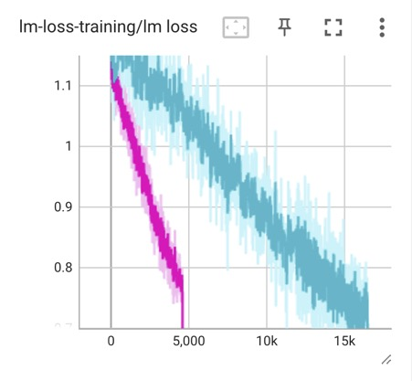
    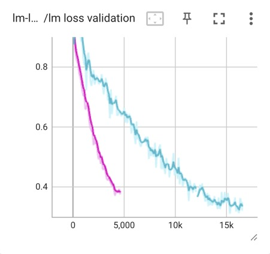
  </div>

- [9/15/2023] Tigerbot-70b-chat(v2)和Tigerbot-13b-chat(v3)更新发布: [[模型下载](#模型下载)]

    - 用更少但更高质量的数据，约5M指令完成数据，覆盖100+任务类型，符合自然用户分布；
    - 用10K人类标注数据进行多维度对齐，包括：事实性，创造性，丰富性，安全性和格式等；
    - 在10+项基准评测中，中英文综合能力均超过上一版本和Llama-2，达到SOTA.

  <p align="center" width="100%">
   		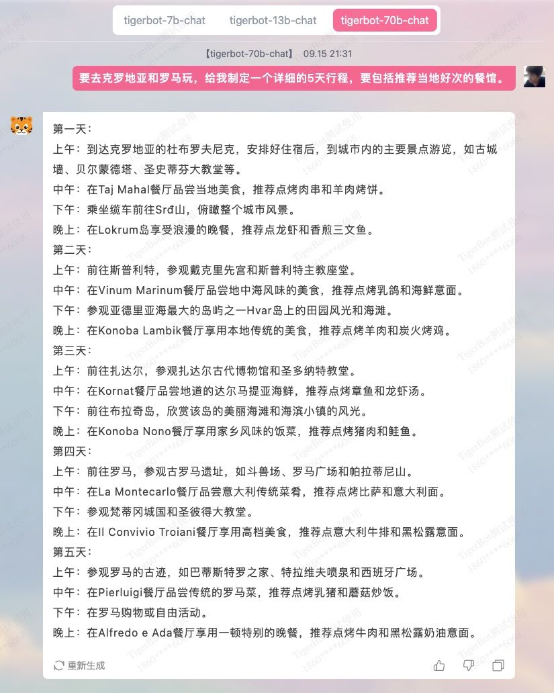
  </p>

- [9/06/2023]
  Tigerbot-70b发布，继续开源和免费商用: [[paper](https://github.com/TigerResearch/TigerBot/wiki/TigerBot%E2%80%9070B%E5%8F%91%E5%B8%83%EF%BC%81)][[模型下载](#模型下载)]:
  fire:

    - Tigerbot-70b-base: 在Llama-2-70b的基础上继续预训练，模型综合能力在mmlu等10项主流基准测试中，优于Llama-2-70b，达到业内SOTA；
        - 用高质量的300 billion tokens的多语言数据,
        - 算法上使用了GQA, flash-attn, RoPE，holistic-training等技术,
        - 训练采用了tensor/pipeline-partition技术，计算效率达到Llama-2 paper中报告的SOTA;
    - Tigerbot-70b-chat: 在Tigerbot-70b-base基础上，用20M指令完成数据进行sft，和10K人类标注的gold
      set进行rejection-sampling对齐；
    - 同步开放Tigerbot-70b-chat-api，继续对教育和科研开发者免费。
    <p align="center" width="100%">
  		</a>
   		</a>
  </p>

- [8/25/2023]
  TigerBot更新13b-base模型: [[模型下载](#模型下载)][[测评](#测评)]

    - TigerBot-13B-base: 增加了一倍训练数据，至600B
      tokens，定向增加了高质量中英文数学推理类和科学文献类数据，优化了中文网络数据的清洗（在格式、口语、知识性等方面）。在13项主流基准评测中，英文综合能力优于Llama-2-13b
      5%，中文超30%。[[测评](#测评)]
      
    - 开放了基于[opencompass](https://github.com/InternLM/opencompass)
      的自动评测体系，以提倡reproducibility。[[测评](#测评)]

- [8/21/2023] TigerBot更新发布7b和13b base/chat模型: [[模型下载](#模型下载)][[测评](#测评)]

    - TigerBot-7B-base: 基于Llama-2-7B增量预训练300B tokens，补充了Llama-2不足的中文、代码和推理等数据，并使用holistic training（全局训练）方法；在13项中英文主流benchmark中，优于Llama-2-7B 33%，领先于国内外同等开源模型;
    - TigerBot-7B-chat: 基于TigerBot-7B-base用20M涵盖多任务的数据进行指令微调（sft）和拒绝采样对齐（rs-hil）；在13项中英文主流benchmark中，优于Llama-2-7B-chat 29%，亦领先于国内外同等开源模型；
    - TigerBot-13B-chat: 基于TigerBot-13B-base用20M涵盖多任务的数据进行指令微调（13b-v1用了5M数据)，并在中英文能力上做了更好的权衡；在13项中英文主流benchmark中，优于Llama-2-13B-chat 15%，领先于国内外同等开源模型;
    - 以上tigerbot-api也同步更新 [[tigerbot-api](https://www.tigerbot.com/api-reference)]。

- [8/19/2023]
  TigerBot推理（tigerbot.com和tigerbot-api）启用 [TGI](https://github.com/huggingface/text-generation-inference)，达到3x
  QPS和2x 响应速度。

https://github.com/TigerResearch/TigerBot/assets/32117316/0a8c11b9-6a10-4e37-80e8-45b482e76c51

- [8/08/2023] TigerBot 2023.08 (V3) release:
  虎博很高兴的发布TigerBot-13B大模型，在Llama-2的基础上以虎博积累的技术和数据继续训练，不但保持了Llama-2出色的英文能力，更是在中文能力上填补了Llama-2的不足，各项主流中文任务中超过Llama-2的49%，在开源同类模型中具有竞争力。:
  fire: [[paper](https://github.com/TigerResearch/TigerBot/wiki/Tigerbot%E2%80%9013B-is-All-You-Need)]

    - TigerBot-13B-base: 基于Llama-2-13B继续预训练300B tokens，扩充了中文词表到60K vocabulary, 并采用holistic
      training在预训练中直接使模型具有九成的指令完成能力。在主流英文基准测试中超过Llama-2-13B-base的7%，在中文测试中综合能力超过Llama-2-13B-base的49%，在国内外主流开源基座模型中处于领先位置。[[测评](#测评)][[模型下载](#模型下载)]
    - TigerBot-13B-chat: 基于TigerBot-13B-base用5M指令数据微调，并采用rejection sampling
      fine-tune对齐人类需求。在主流英文基准测试中达到Llama-2-13B-chat的101%，在中文测试中综合能力超过Llama-2-13B-chat的47%，在国内外主流开源模型中亦处于领先位置。chat模型可以通过`python infer.py --model_path TigerResearch/tigerbot-13b-chat`
      使用。[[测评](#测评)][[模型下载](#模型下载)]
    - TigerBot-API: chat和summarization api
      将自动升级到TigerBot-13B-chat，对科研教育用户免费，对商用开发者保持价格不变。[[tigerbot-api](https://www.tigerbot.com/api-reference)]

- [8/03/2023] TigerBot 兼容 OpenAI
  接口。[[tigerbot-api](https://www.tigerbot.com/api-reference/chat?codeLanguage=python-openai)]

- [7/26/2023] TigerBot 开放 search-api [[tigerbot-api](https://www.tigerbot.com/api-reference/search)]

<p align="center" width="100%">
	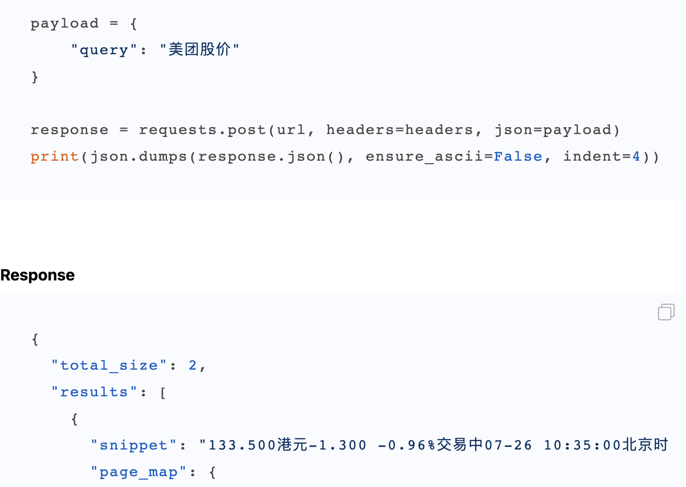</a>
</p>

- [7/08/2023] TigerBot 2023.07 (V2)
  release [[paper](https://github.com/TigerResearch/TigerBot/wiki/TigerBot-Version2)] :fire:

    - tigerbot-7b-base (v2), 在 1.5TB 高质量数据上充分预训练（千卡耗时 4 周，算力成本～ 300 万），在中英文公开数据测评优于
      bloom/llama 同等模型 15-30%；[[测评](#测评)][[模型下载](#模型下载)]

    - tigerbot-7b-sft (v2), 在 base-v2 基础上微调的 sft-v2 在 2000 万/20G 高质量清洗和配比的数据上充分训练，在 9
      项公开语料测评上优于 sft-v1
      9.3%；[[测评](#测评)][[模型下载](#模型下载)]

      新模型可通过以下代码加载：

      ```python
      import transformers
      
      # 下载过旧版的用户需要指定`force_download=True`避免使用旧版缓存
      model_sft = transformers.AutoModelForCausalLM.from_pretrained('TigerResearch/tigerbot-7b-sft', force_download=True)
      model_base = transformers.AutoModelForCausalLM.from_pretrained('TigerResearch/tigerbot-7b-base', force_download=True)
      ```

    - tigerbot 开启搜索模式，对接主流中英文搜索引擎，和结构化工具（如天气，股市，计算器等），打开 LLM+search 的应用场景，同时开放
      chat-api with internet search
      switch；[[TigerBot with search mode (default off) :earth_asia:](https://www.tigerbot.com/chat)][[paper](https://github.com/TigerResearch/TigerBot/wiki/TigerBot-upgraded-with-internet-search)]

    - tigerbot 开启流式生成模式，同时开放 chat-api with streaming
      switch; [[TigerBot](https://www.tigerbot.com/chat)][[TigerBot-API](https://www.tigerbot.com/api-reference/chat)]

    - tigerbot-api 全新升级，开放 LLM 应用开发常用的 api 工具，包括：LLM (chat, plugin, finetune), text (embedding,
      summarization, pdf2text), vision (text2image)。[[TigerBot-API](https://www.tigerbot.com/api-reference/chat)]

- [6/27/2023] PEFT TigerBot with QLoRA: 在单张 3090 上使用 qlora 微调 tigerbot-7b-sft，加速 16 倍，和/或减少
  GPU3/4，同时防止了对下游数据的过拟合。[[code](https://github.com/TigerResearch/TigerBot/blob/main/train/train_with_qlora.py)] [[paper](https://github.com/TigerResearch/TigerBot/wiki/PEFT-TigerBot-7b-with-QLoRA,-building-an-domain-LLM-on-one-consumer-level-GPU-in-hours)][[模型下载](#模型下载)]

<p align="center" width="100%">
	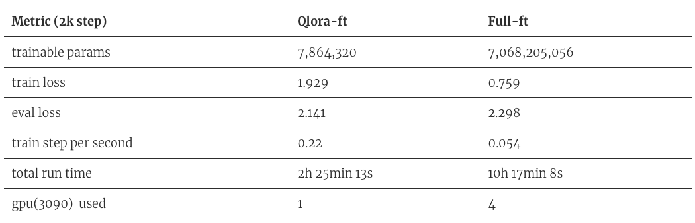</a>
</p>

- [6/26/2023] TigerBot now is on desktop! [使用 TigerBot 和 Svelte 框架制作的聊天机器人](#开发者生态)，感谢 @SaraiQX ！
- [6/20/2023] Tigerbot 的云端 api 如何在 langchian 中替代 openai
  来应用(<a href="https://github.com/TigerResearch/TigerBot/blob/main/apps/tigerbot_chatapi.py">sample code</a>) 感谢
  @wordweb ！

<p align="center" width="100%">
	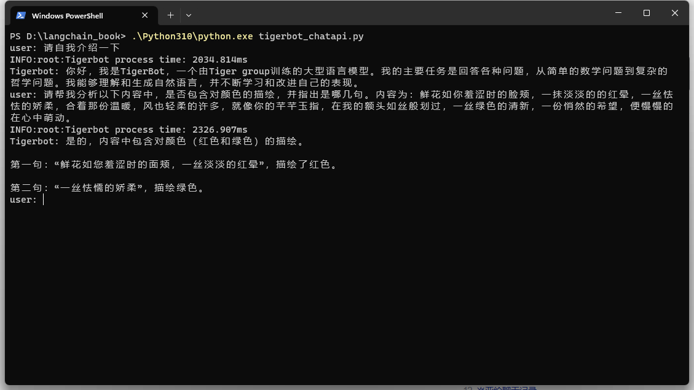</a>
</p>

- [6/13/2023] plug-in api 升级，放出：[搜索结果数量、prompt 前缀和 tf-idf, embedding mixture weights](#tigerbot-api)
- [6/13/2023] 模型已支持更迅速的[本地下载](#模型下载)
- [6/13/2023] TigerBot now is on QQ! [基于本地知识库的 TigerBot 大语言模型 qq 群知识库 bot 应用实现](#开发者生态)，感谢
  @wordweb ！
- [6/09/2023] 新增 stream infer 和 web demo，感谢 @Tlntin ！
- [6/08/2023] TigerBot 已经可以在[colab, windows, langchain 和 webui](#开发者生态)上跑啦，感谢 @wordweb @runfuture !

## 目录

- [环境安装](#环境安装)
- [模型下载](#模型下载)
- [推理](#推理)
- [训练](#训练)
- [测评](#测评)
- [开源数据集](#开源数据集)
- [Tigerbot API](#tigerbot-api)
- [其他](#其他)

## 环境安装

```bash

conda create --name tigerbot python=3.8
conda activate tigerbot
conda install pytorch torchvision torchaudio pytorch-cuda=11.7 -c pytorch -c nvidia

git clone https://github.com/TigerResearch/TigerBot
cd TigerBot
pip install -r requirements.txt
```

## 模型下载

| Model             | Version                                                      | Architecture | Disk size (GB) | Note                      |
| ----------------- | ------------------------------------------------------------ | ------------ | -------------- | ------------------------- |
| tigerbot-70b-base | v2 [[🤗](https://huggingface.co/TigerResearch)][[🤖](https://modelscope.cn/organization/TigerResearch)] | llama-2      | 129           | From llama-2-70b weights  |
|                   | v1 [[🤗](https://huggingface.co/TigerResearch)][[🤖](https://modelscope.cn/organization/TigerResearch)] | llama-2      | 129           | From llama-2-70b weights  |
| tigerbot-70b-chat | v4-4k [[🤗]](https://huggingface.co/TigerResearch)[[🤖](https://modelscope.cn/organization/TigerResearch)] | llama-2      | 129           | From tigerbot-70b-base v2  |
|                   | v4 [[🤗]](https://huggingface.co/TigerResearch)[[🤖](https://modelscope.cn/organization/TigerResearch)] | llama-2      | 129           | From tigerbot-70b-base v2  |
|                   | v3 [[🤗]](https://huggingface.co/TigerResearch)[[🤖](https://modelscope.cn/organization/TigerResearch)] | llama-2      | 129           | From tigerbot-70b-base v1  |
|                   | v2 [[🤗](https://huggingface.co/TigerResearch)][[🤖](https://modelscope.cn/organization/TigerResearch)] | llama-2      | 129           | From tigerbot-70b-base v1  |
|                   | v1 [[🤗](https://huggingface.co/TigerResearch)] | llama-2      | 129           | From tigerbot-70b-base v1  |
| tigerbot-70b-chat-4bit | v4 [[🤗](https://huggingface.co/TigerResearch)] | llama-2      | 37           | From tigerbot-70b-chat v4|
|                        | v3 [[🤗](https://huggingface.co/TigerResearch)] | llama-2      | 37           | From tigerbot-70b-chat v3|
|                        | v2 [[🤗](https://huggingface.co/TigerResearch)] | llama-2      | 37           | From tigerbot-70b-chat v2|
|                        | v1 [[🤗](https://huggingface.co/TigerResearch)] | llama-2      | 37           | From tigerbot-70b-chat v1|
| tigerbot-13b-base | v3 [[🤗](https://huggingface.co/TigerResearch)][[🤖](https://modelscope.cn/organization/TigerResearch)] | llama-2      | 26.6           | From llama-2-13b weights  |
|                   | v2 [[🤗](https://huggingface.co/TigerResearch)][[🤖](https://modelscope.cn/organization/TigerResearch)] | llama-2      | 26.6           | From llama-2-13b weights  |
|                   | v1 [[🤗](https://huggingface.co/TigerResearch)] | llama-2      | 26.6           | From llama-2-13b weights  |
| tigerbot-13b-chat | v5-4k [[🤗](https://huggingface.co/TigerResearch)][[🤖](https://modelscope.cn/organization/TigerResearch)] | llama-2      | 26.6           | From tigerbot-13b-base v3 |
|                   | v5 [[🤗](https://huggingface.co/TigerResearch)][[🤖](https://modelscope.cn/organization/TigerResearch)] | llama-2      | 26.6           | From tigerbot-13b-base v3 |
|                   | v4 [[🤗](https://huggingface.co/TigerResearch)][[🤖](https://modelscope.cn/organization/TigerResearch)] | llama-2      | 26.6           | From tigerbot-13b-base v2 |
|                   | v3 [[🤗](https://huggingface.co/TigerResearch)][[🤖](https://modelscope.cn/organization/TigerResearch)] | llama-2      | 26.6           | From tigerbot-13b-base v2 |
|                   | v2 [[🤗](https://huggingface.co/TigerResearch)] | llama-2      | 26.6           | From tigerbot-13b-base v2 |
|                   | v1 [[🤗](https://huggingface.co/TigerResearch)] | llama-2      | 26.6           | From tigerbot-13b-base v1 |
| tigerbot-13b-chat-4bit | v5 [[🤗](https://huggingface.co/TigerResearch)] | llama-2      | 11.5           | From tigerbot-13b-chat v5-4k |
|                        | v4 [[🤗](https://huggingface.co/TigerResearch)] | llama-2      | 11.5           | From tigerbot-13b-chat v4 |
| tigerbot-7b-base  | v3 [[🤗](https://huggingface.co/TigerResearch)][[🤖](https://modelscope.cn/organization/TigerResearch)] | llama-2      | 13.9           | From llama-2-7b weights   |
|                   | v2 [[🤗](https://huggingface.co/TigerResearch)] | bloom        | 16.2           | From bloom weights        |
|                   | v1 [[🤗](https://huggingface.co/TigerResearch)] | bloom        | 16.2           | From bloom weights        |
| tigerbot-7b-chat  | v3 [[🤗](https://huggingface.co/TigerResearch)][[🤖](https://modelscope.cn/organization/TigerResearch)] | llama-2      | 13.9           | From tigerbot-7b-base v3  |
|                   | v2 [[🤗](https://huggingface.co/TigerResearch)] | bloom        | 16.2           | From tigerbot-7b-base v2  |
|                   | v1 [[🤗](https://huggingface.co/TigerResearch)] | bloom        | 16.2           | From tigerbot-7b-base v1  |
| tigerbot-7b-chat-8bit  | v3 [[🤗](https://huggingface.co/TigerResearch)] | llama-2      | 10.8           | From tigerbot-7b-chat v3  |
| tigerbot-7b-chat-4bit  | v3 [[🤗](https://huggingface.co/TigerResearch)] | llama-2      | 6.5           | From tigerbot-7b-chat v3  |
| tigerbot-180b-base | v2 [[🤗](https://huggingface.co/TigerResearch)][[🤖](https://modelscope.cn/organization/TigerResearch)] | bloom        | 347.6          | From bloom weights        |
| tigerbot-180b-chat | v2 [[🤗](https://huggingface.co/TigerResearch)][[🤖](https://modelscope.cn/organization/TigerResearch)] | bloom        | 347.6          | From tigerbot-180b-chat v2        |
|                    | v1 [[🤗](https://huggingface.co/TigerResearch)] | bloom        | 347.6          | From bloom weights        |


## 推理

### CLI

```shell
CUDA_VISIBLE_DEVICES=0 python infer.py --model_path tigerbot-13b-chat --max_input_length 1024 --max_generate_length 1024 --streaming True
```

参数：

- `--model_path`: 模型路径
- `--model_type=chat`: base/chat
- `--max_input_length=1024`: 最大输入长度
- `--max_generate_length=1024`: 最大输出长度
- `--rope_scaling=None`: 长度外推方法(dynamic/yarn supported now)
- `--rope_factor=8.0`: 外推参数
- ~~`--streaming`: 流式输出~~

输入 `clear` 可以清空对话历史，输入 `exit` 终止推理对话。

<p width="100%">
    
</p>

### WebPage

```
export PYTHONPATH='./' ; export CUDA_VISIBLE_DEVICES=0 ; streamlit run apps/web_demo.py -- --model_path tigerbot-13b-chat
```

参数同CLI启动参数

### 本地API

CLI/WebPage均为demo性质。[TGI](https://github.com/huggingface/text-generation-inference)实现了混合batch，request
queue等工程特性，如有大量推理需求，推荐通过TGI镜像提供服务。

```shell
docker run --gpus '"device=0,1,2,3"' -d -p 8080:80 -v PATH-TO-MODEL-DIR:/model ghcr.io/huggingface/text-generation-inference:1.1.1 --model-id /model --max-total-tokens=1024 --max-input-length=1024 --max-batch-prefill-tokens=1024
```

请根据模型规模与硬件情况选择合适的参数。一般来说7B/13B需要A100 40G * 1，70B需要A100 * 4。

注意，TGI部署服务，生成控制参数需要在每个请求中控制。

### 量化

#### exllamav2量化推理

使用[exllamav2](https://github.com/turboderp/exllamav2a)加载[TigerResearch/tigerbot-70b-chat-v4-4bit-exl2]进行推理，推理速度加快

```
# 安装exllamav2
git clone https://github.com/turboderp/exllamav2
cd exllamav2
pip install -r requirements.txt

#  启动推理
CUDA_VISIBLE_DEVICES=0 python other_infer/exllamav2_hf_infer.py --model_path ${MODEL_PATH}
```

`MODEL_PATH`为量化模型路径，如 `TigerResearch/tigerbot-70b-chat-v4-4bit-exl2`

使用以上量化方式，请将transformers、bitsandbytes等包升级到最新版（目前transformers==4.33.1和bitsandbytes==0.41.1可以正常使用）

```
pip install -U transformers bitsandbytes
```

#### 动态量化模型加载

此方式为在线量化与推理

```
CUDA_VISIBLE_DEVICES=0 python other_infer/quant_infer.py --model_path ${MODEL_DIR} --wbit 8
```

## 训练

### 预训练

启动训练前安装 DeepSpeed

```
git clone git@github.com:microsoft/DeepSpeed.git
cd DeepSpeed
rm -rf build
TORCH_CUDA_ARCH_LIST="8.0" DS_BUILD_CPU_ADAM=1 DS_BUILD_UTILS=1 pip install . \
--global-option="build_ext" --global-option="-j8" --no-cache -v \
--disable-pip-version-check 2>&1 | tee build.log
```

TORCH_CUDA_ARCH_LIST 根据你运行的 GPU 架构做调整，获取 TORCH_CUDA_ARCH_LIST

```
CUDA_VISIBLE_DEVICES=0 python -c "import torch; print(torch.cuda.get_device_capability())"
```

如果返回的结果是(8, 0)，那么 TORCH_CUDA_ARCH_LIST="8.0"

#### 启动训练

启动`tigerbot-7b`训练至少需要 1 x A100 (40GB), 启动`tigerbot-180b`至少需要 16 x A100 (40GB)

```
deepspeed \
--include="localhost:0,1,2,3" \
./train_clm.py \
--deepspeed ./ds_config/ds_config_zero3.json \
--model_name_or_path TigerResearch/tigerbot-7b-base \
--dataset_name TigerResearch/dev_pretrain \
--do_train \
--output_dir ./ckpt-clm \
--overwrite_output_dir \
--preprocess_num_workers 8 \
--num_train_epochs 5 \
--learning_rate 1e-5 \
--evaluation_strategy steps \
--eval_steps 10 \
--bf16 True \
--save_strategy steps \
--save_steps 10 \
--save_total_limit 2 \
--logging_steps 10 \
--tf32 True \
--per_device_train_batch_size 2 \
--per_device_eval_batch_size 2
```

### 微调

#### 启动训练

```
deepspeed \
--include="localhost:0,1,2,3" \
./train_sft.py \
--deepspeed ./ds_config/ds_config_zero3.json \
--model_name_or_path TigerResearch/tigerbot-7b-base \
--dataset_name TigerResearch/dev_sft \
--do_train \
--output_dir ./ckpt-sft \
--overwrite_output_dir \
--preprocess_num_workers 8 \
--num_train_epochs 5 \
--learning_rate 1e-5 \
--evaluation_strategy steps \
--eval_steps 10 \
--bf16 True \
--save_strategy steps \
--save_steps 10 \
--save_total_limit 2 \
--logging_steps 10 \
--tf32 True \
--per_device_train_batch_size 2 \
--per_device_eval_batch_size 2
```

## 测评

我们使用经典的中英文benchmark自动评测，共13项任务，涵盖代码，常识推理，阅读理解，数学，自然语言理解等。我们基于opencompass建立自动评测体系（感谢@opencompass）

```
# 安装
cd opencompass
pip install -e .

# 下载数据集到 data/ 处
wget https://github.com/InternLM/opencompass/releases/download/0.1.1/OpenCompassData.zip
unzip OpenCompassData.zip

#运行测评任务：
CUDA_VISIBLE_DEVICES=0,1,2 python run.py configs/eval_tigerbot_13b.py -w outputs/tigerbot-13b-base
```

总分为各类任务的平均分

chat模型测评结果

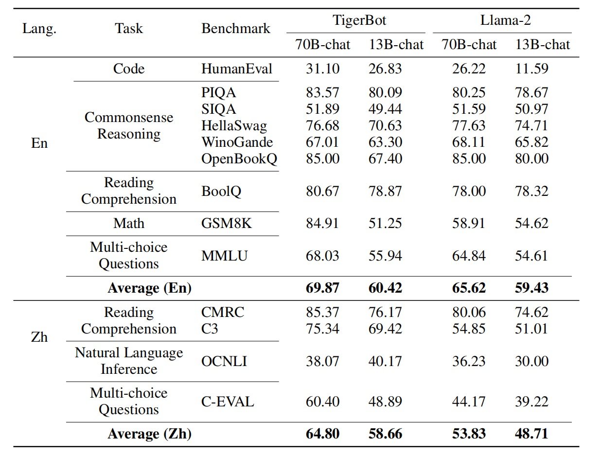

base模型测评结果


## 开源数据集

### 预训练数据

<details>
基于 GPT3 的 pretrain 的数据分布，采集中文书籍，互联网，和百科类数据，并通过数据源质量分过滤和 tf-idf soft deduping，从 20TB 数据过滤到 2TB，保持语言和类目的比例，并在此基础上随机抽样 100G 数据开源：

- <a href=https://huggingface.co/datasets/TigerResearch/pretrain_zh>中文开源预训练集 -
  55G，包含中文书籍、中文互联网、中文百科 - 下载 [hugging face]</a>
- <a href=https://huggingface.co/datasets/TigerResearch/pretrain_en>英文开源预训练集 -
  51G，包含英文书籍、英文互联网、英文百科 - 下载 [hugging face]</a>

  | 类型       | 磁盘占用 | 来源 |
    | ---------- | -------- | ---- |
  | 中文书籍   | 12G      | 自研 |
  | 中文互联网 | 25G      | 自研 |
  | 中文百科   | 19G      | 自研 |
  | 英文书籍   | 22G      | 开源 |
  | 英文互联网 | 6.9G     | 开源 |
  | 英文百科   | 22G      | 开源 |
  | **总量**   | **106G** |      |

- 完整预训练数据占比如图所示:

<p align="center" width="100%">
</a>
</p>

- 中文书籍及代码细分:

<p width="100%">
    
</p>
</details>

### 微调数据

<details> 
<summary><b>数据搜集</b></summary>

模型中使用的微调数据的搜集思想如下：

a. 从用户指令的自然分布，人工标注总结 10 大类，120 小类任务，例如，事实性问答，开放式创作，语法分析，代码编辑等；

b. self-instruct: 参考 Alpaca self-instruct 方法，扩充中英文 seed_tasks，增加一些中文习惯种子问题，基于此生成 2M 中文(本次开源
0.5M)及 0.1M 英文(本次开源 50k)；

c. human-labeling: 基于人工写题及答案、网络搜集方式，整理加工问答集数据，在开源列表中标识为[自研]部分，本次开放部分数据；

d. open-source data cleaning: 基于各类公开数据集转换清洗，其中[自研*]部分，表示基于原始数据进行二次开发后得到，[开源]
部分数据集一般原始数据即为较规整的问答数据，进行简单清洗得到；

e. 总的数据分布符合用户指令自然分布。

</details>
<details> 
<summary><b>数据清洗</b></summary>
- 由于各类数据质量存在差异，通过 Alpaca Self-Instruct 生成的数据亦存在各种问题。因此，我们经过细致的人工校验和分类，总结出一套全面且系统化的数据清洗规则与方法。
- 整体规则可以划分为**过滤类规则**和**清洗类规则**两大类。其中，命中过滤规则的数据项将被弃用，而清洗规则旨在处理并保留所需的数据。
- 同时，在数据梳理与积累的过程中，我们也不断对清洗规则进行迭代和优化。
- 通用清洗规则描述如下所示：

a. 过滤类-敏感词规则：基于积累的敏感词库，清洗丢弃涉政、涉黄、涉暴、涉恐等数据项；

b. 过滤类-无效输入输出：此类规则主要针对 Self-Instruct 生成数据缺陷进行专项清理，根据输入输出分别制定规则，以丢弃一些无效的数据项；

> 无效输入如"<一段文本>"，无效输出如"[图画]"；

c. 清洗类-关键词规则：根据整理的关键词/正则列表进行数据的替换，包括：清理特殊标志位字符、清理非可见字符、清理标签、繁简转换等；

d. 清洗类-特殊逻辑规则：此类规则用于清洗一些特殊现象数据，如指令与输入重复等，如下所示：

> `{"instruction": "描述如何做一道红烧肉。请提供食材和详细的步骤。", "input": "请描述如何做一道红烧肉，提供食材和详细步骤。", ...}`

</details>

<details> 
<summary><b>数据开源</b></summary>
- 指令数据集, 当前开源 120W 问答对，磁盘空间 1.1G (数据集开放到 huggingface，中英文指令明细及下载如下表）
- <a href=https://huggingface.co/datasets/TigerResearch/sft_zh>中文-微调指令集-合集 - 53W 条 - 下载 [hugging face]</a>
- <a href=https://huggingface.co/datasets/TigerResearch/sft_en>英文-微调指令集-合集 - 67W 条 - 下载 [hugging face]</a>

| 类型        | 语言 | 数据集                                                                                                                              | 数量         | 来源   |
|-----------|----|----------------------------------------------------------------------------------------------------------------------------------|------------|------|
| alpaca 中文 | 中文 | [tigerbot-alpaca-zh-0.5m](https://huggingface.co/datasets/TigerResearch/tigerbot-alpaca-zh-0.5m)                                 | 0.5m       | 自研   |
| 百科问答      | 中文 | [tigerbot-wiki-qa-1k](https://huggingface.co/datasets/TigerResearch/tigerbot-wiki-qa-zh-1k)                                      | 1k         | 自研   |
| 名著问答      | 中文 | [tigerbot-book-qa-1k](https://huggingface.co/datasets/TigerResearch/tigerbot-book-qa-1k)                                         | 1k         | 自研   |
| 猜谜语       | 中文 | [tigerbot-riddle-qa-1k](https://huggingface.co/datasets/TigerResearch/tigerbot-riddle-qa-1k)                                     | 1k         | 自研   |
| 阅读理解      | 中文 | [tigerbot-superclue-c3-zh-5k](https://huggingface.co/datasets/TigerResearch/tigerbot-superclue-c3-zh-5k)                         | 5k         | 自研\* |
| 问答        | 中文 | [tigerbot-HC3-zh-12k](https://huggingface.co/datasets/TigerResearch/tigerbot-HC3-zh-12k)                                         | 12k        | 开源   |
| 知乎问答      | 中文 | [tigerbot-zhihu-zh-10k](https://huggingface.co/datasets/TigerResearch/tigerbot-zhihu-zh-10k)                                     | 10k        | 开源   |
| alpaca 英文 | 英文 | [tigerbot-alpaca-en-50k](https://huggingface.co/datasets/TigerResearch/tigerbot-alpaca-en-50k)                                   | 50k        | 自研   |
| 头脑风暴      | 英文 | [tigerbot-dolly-Brainstorming-en-1.7k](https://huggingface.co/datasets/TigerResearch/tigerbot-dolly-Brainstorming-en-1.7k)       | 1.7k       | 开源   |
| 分类        | 英文 | [tigerbot-dolly-Classification-en-2k](https://huggingface.co/datasets/TigerResearch/tigerbot-dolly-Classification-en-2k)         | 2k         | 开源   ｜
| 代码        | 英文 | [tigerbot-kaggle-leetcodesolutions-en-2k](https://huggingface.co/datasets/TigerResearch/tigerbot-kaggle-leetcodesolutions-en-2k) | 2k         | 自研\* |
| 食谱生成      | 英文 | [tigerbot-kaggle-recipes-en-2k](https://huggingface.co/datasets/TigerResearch/tigerbot-kaggle-recipes-en-2k)                     | 2k         | 开源   |
| 病历生成      | 英文 | [tigerbot-mt-note-generation-en](https://huggingface.co/datasets/TigerResearch/tigerbot-mt-note-generation-en)                   | 450        | 开源   |
| 多轮对话      | 英文 | [tigerbot-OIG-multichat-en-50k](https://huggingface.co/datasets/TigerResearch/tigerbot-OIG-multichat-en-50k)                     | 50k        | 自研\* |
| 综合问答      | 英文 | [tigerbot-stackexchange-qa-en-0.5m](https://huggingface.co/datasets/TigerResearch/tigerbot-stackexchange-qa-en-0.5m)             | 0.5m       | 开源   |
| wiki 问答   | 英文 | [tigerbot-wiki-qa-bart-en-10k](https://huggingface.co/datasets/TigerResearch/tigerbot-wiki-qa-bart-en-10k)                       | 10k        | 开源   |
| 如何做类教程    | 英文 | [tigerbot-youtube-howto-en-50k](https://huggingface.co/datasets/TigerResearch/tigerbot-youtube-howto-en-50k)                     | 50k        | 开源   |
| **总量**    |    |                                                                                                                                  | **120W 条** |

> 更多数据集陆续整理开放中...

</details>

### 领域数据

<details>
  开放金融、法律、百科相关领域数据，作为 rethink 外部数据源

| 类型                                                                              | 数量           |
|---------------------------------------------------------------------------------|--------------|
| [金融-研报](https://huggingface.co/datasets/TigerResearch/tigerbot-research-plugin) | 2W 篇         |
| [金融-财报](https://huggingface.co/datasets/TigerResearch/tigerbot-earning-plugin)  | 2500 篇       |
| [法律](https://huggingface.co/datasets/TigerResearch/tigerbot-law-plugin)         | 11 类 5.5W 条款 |
| [百科](https://huggingface.co/datasets/TigerResearch/tigerbot-wiki-plugin)        | 10W 词条       |

</details>

## Tigerbot API

<details>

### [chat](https://www.tigerbot.com/api-reference/chat)

<details><summary><b>示例</b></summary>

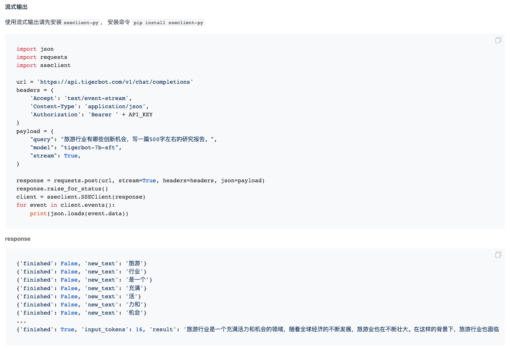
</details>

### [plugin](https://www.tigerbot.com/api-reference/plugin)

<details><summary><b>示例</b></summary>
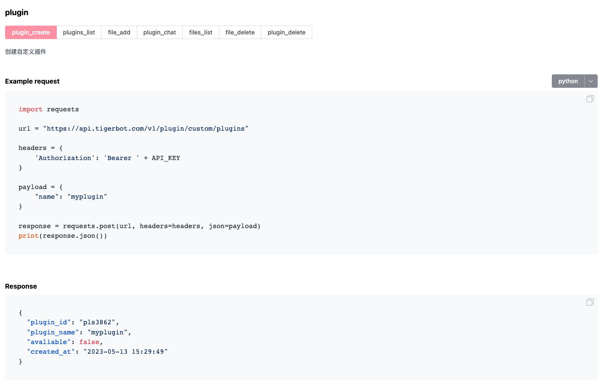
</details>

### [finetune](https://www.tigerbot.com/api-reference/finetune)

<details><summary><b>示例</b></summary>
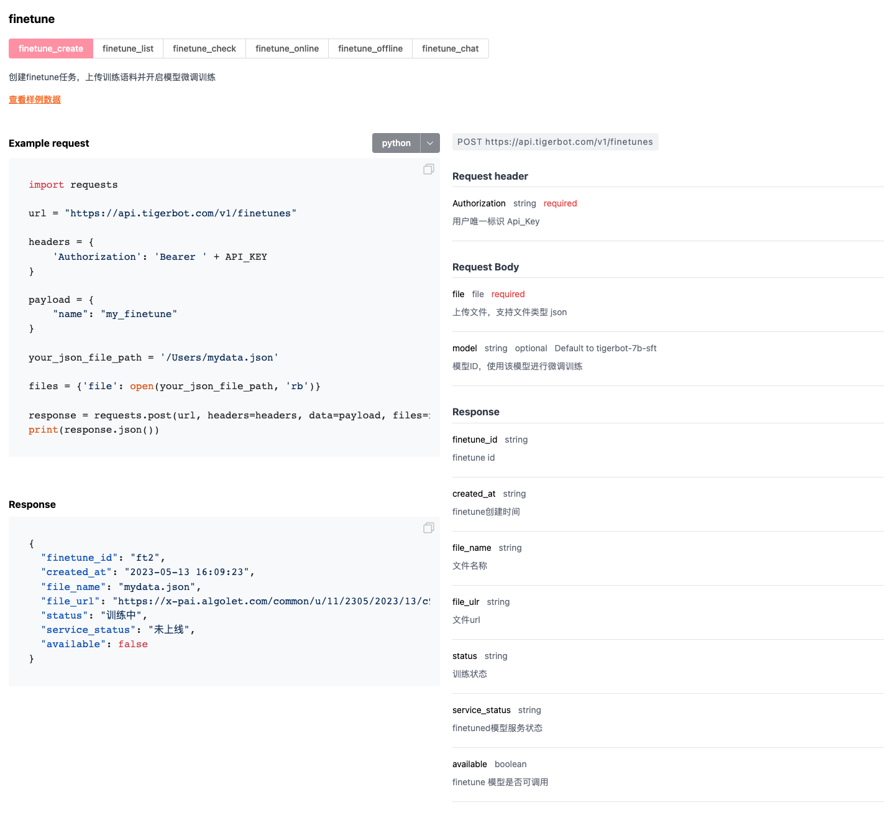
</details>

### [embedding](https://www.tigerbot.com/api-reference/embedding)

<details><summary><b>示例</b></summary>
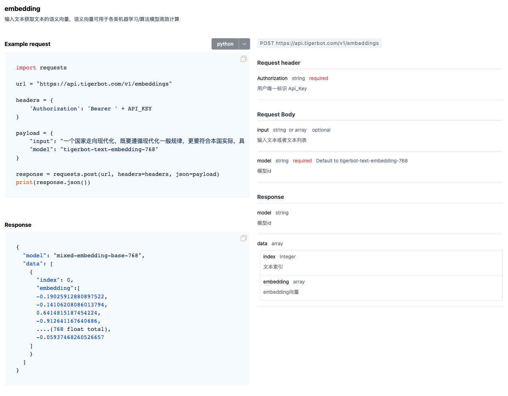
</details>

### [summarization](https://www.tigerbot.com/api-reference/summarization)

<details><summary><b>示例</b></summary>
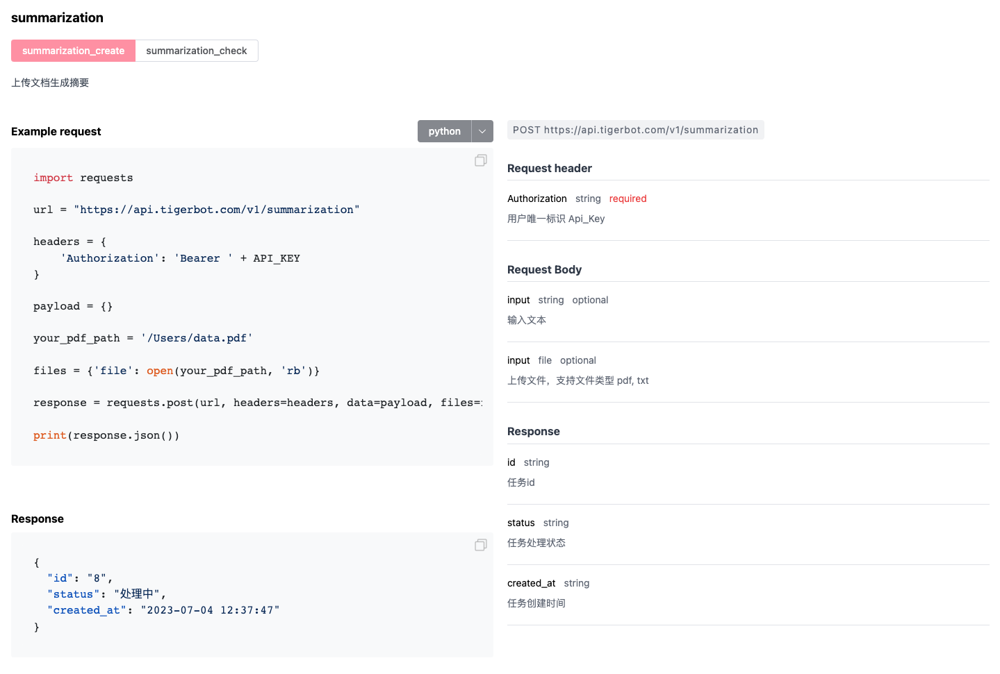
</details>

### [pdf2text](https://www.tigerbot.com/api-reference/pdf2text)

<details><summary><b>示例</b></summary>
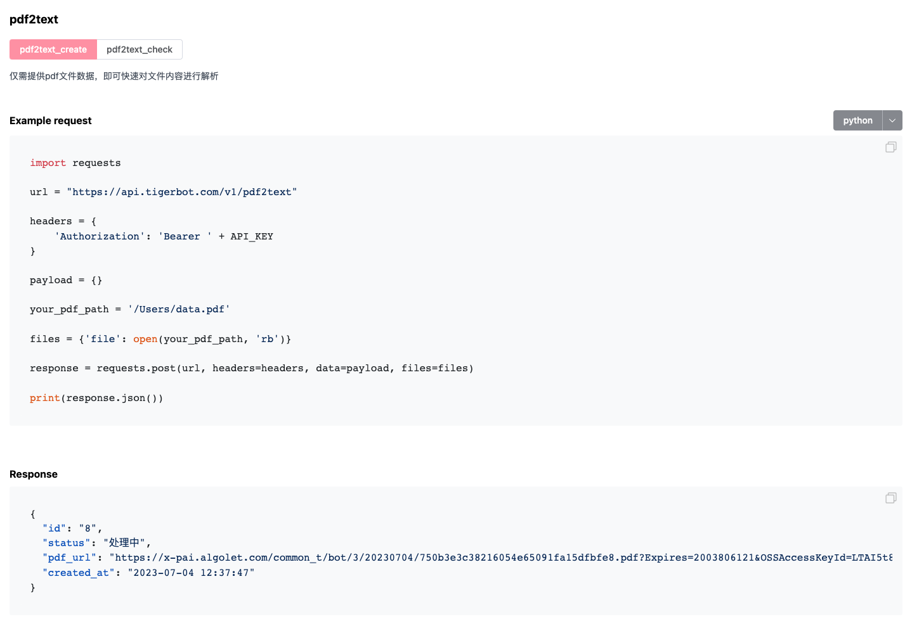
</details>

### [text2image](https://www.tigerbot.com/api-reference/text2image)

<details><summary><b>示例</b></summary>
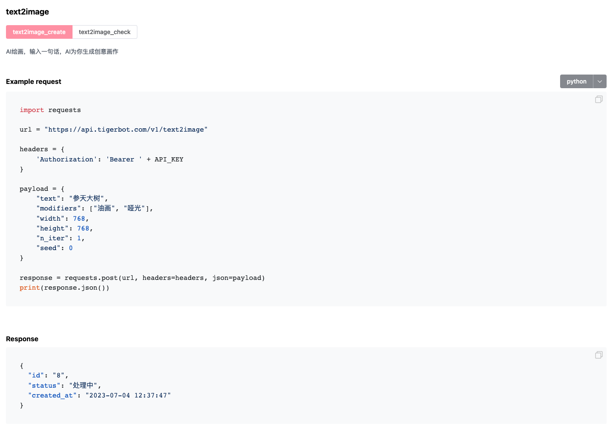
</details>
</details>

## 其他

<details><summary><b>案例</b></summary>


</details>

<details><summary><b>开发者生态</b></summary>

- [使用 TigerBot 和 Svelte 框架制作的聊天机器人，可快速打包成桌面应用](https://github.com/SaraiQX/tigerbot-svelte-app)
- [基于本地知识库的 TigerBot 大语言模型 qq 群知识库 bot 应用实现](https://github.com/wordweb/Tiger-qq-bot)
- [基于本地知识库的 TigerBot、ChatGLM 等大语言模型应用实现](https://github.com/wordweb/langchain-ChatGLM-and-TigerBot)
- [Run TigerBot on Colab](https://github.com/runfuture/tigerbot/blob/main/test_tigerbot_7b_sft_4bit_128g.ipynb) - Colab
  版本体验 TigerBot
- [Run TigerBot on Windows](https://www.bilibili.com/video/BV1Ru411a7Kq/) - 在 Windows 系统上使用 TigerBot

</details>

<details><summary><b>加入我们</b></summary>

#### 产品链接

https://www.tigerbot.com

#### 联系电话

021-63888086

#### 联系邮箱

<p>cong.fu@tigerbot.com</p>
<p>wei.cai@tigerbot.com</p>

#### 微信讨论群

</a>

</details>

<details><summary><b>局限性与免责声明</b></summary>
当前模型可能存在生成幻觉、误导性、或歧视性内容。请谨慎使用 TigerBot 系列模型生成的内容，请勿将生成的有害内容进行传播。
如需将模型公开使用或者商用，模型服务所产生的不良影响或者有害言论由服务方负责，本项目开发者不承担任何因使用本项目（包含但不限于数据、模型、代码等）导致的危害或损失。
</details>
