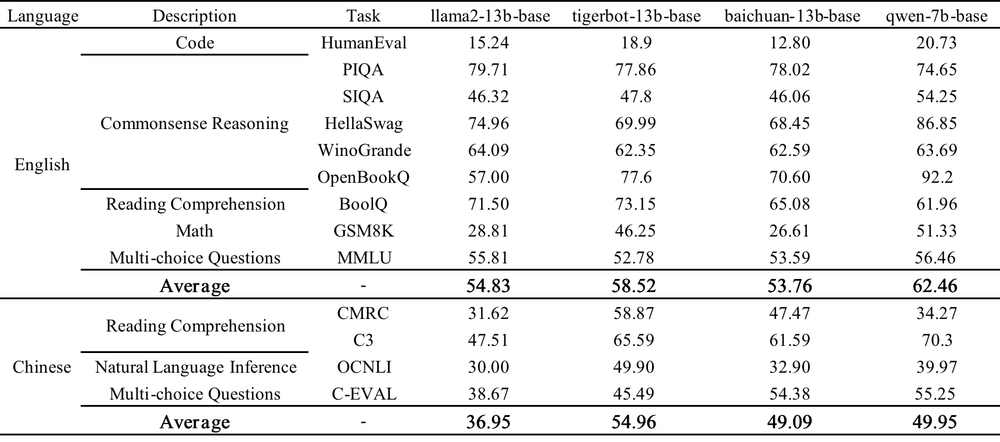
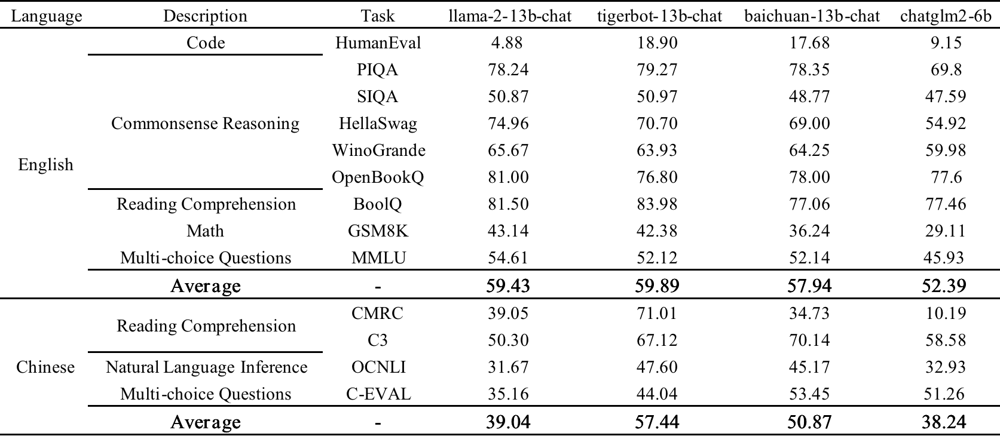
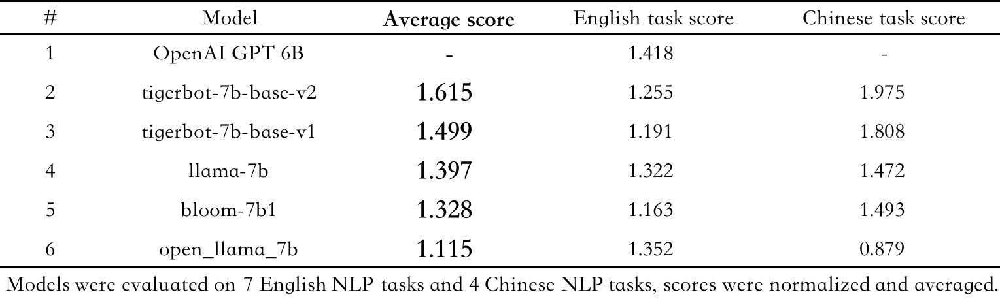
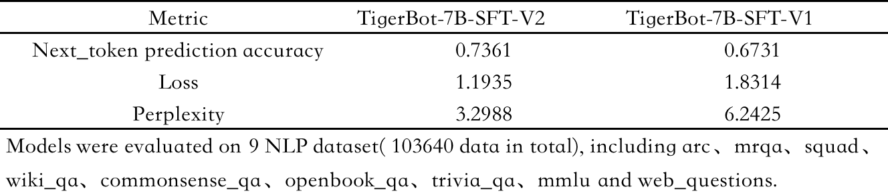

# TigerBot

<p align="center" width="100%">
</a>
</p>
<p align="center">
<font face="黑体" color=orange size=5"> A cutting-edge foundation for your very own LLM. </font>
</p>
<p align="center">
<font face="黑体" color=orange size=5"> 以世界级的基础大模型，贡献于中国式的创新。 </font>
</p>
<p align="center">
   🌐 <a href="https://tigerbot.com/" target="_blank">TigerBot</a> • 🤗 <a href="https://huggingface.co/TigerResearch" target="_blank">Hugging Face</a>
</p>
<h4 align="left">
    <p>
        <b>中文</b> |
        <a href="https://github.com/TigerResearch/TigerBot/blob/main/README_en.md">English</a>
    <p>
</h4>

## 最新发布

- [8/08/2023] TigerBot 2023.08 (V3) release: 虎博很高兴的发布TigerBot-13B大模型，在Llama-2的基础上以虎博积累的技术和数据继续训练，不但保持了Llama-2出色的英文能力，更是在中文能力上填补了Llama-2的不足，各项主流中文任务中超过Llama-2的49%，在开源同类模型中具有竞争力。:fire: [[paper](https://github.com/TigerResearch/TigerBot/wiki/Tigerbot%E2%80%9013B-is-All-You-Need)] 

  - TigerBot-13B-base: 基于Llama-2-13B继续预训练300B tokens，扩充了中文词表到60K vocabulary, 并采用holistic training在预训练中直接使模型具有九成的指令完成能力。在主流英文基准测试中超过Llama-2-13B-base的7%，在中文测试中综合能力超过Llama-2-13B-base的49%，在国内外主流开源基座模型中处于领先位置。[[测评](#测评)][[huggingface](https://huggingface.co/TigerResearch/tigerbot-13b-base)]
  - TigerBot-13B-chat: 基于TigerBot-13B-base用5M指令数据微调，并采用rejection sampling fine-tune对齐人类需求。在主流英文基准测试中达到Llama-2-13B-chat的101%，在中文测试中综合能力超过Llama-2-13B-chat的47%，在国内外主流开源模型中亦处于领先位置。chat模型可以通过`python infer.py --model_path TigerResearch/tigerbot-13b-chat`使用。[[测评](#测评)][[huggingface](https://huggingface.co/TigerResearch/tigerbot-13b-chat)]
  - TigerBot-API: chat和summarization api 将自动升级到TigerBot-13B-chat，对科研教育用户免费，对商用开发者保持价格不变。[[tigerbot-api](https://www.tigerbot.com/api-reference)]

- [8/03/2023] TigerBot 兼容 OpenAI 接口。[[tigerbot-api](https://www.tigerbot.com/api-reference/chat?codeLanguage=python-openai)]

- [7/26/2023] TigerBot 开放 search-api [[tigerbot-api](https://www.tigerbot.com/api-reference/search)]

<p align="center" width="100%">
	</a>
</p>

- [7/08/2023] TigerBot 2023.07 (V2) release [[paper](https://github.com/TigerResearch/TigerBot/wiki/TigerBot-Version2)] :fire:

  - tigerbot-7b-base (v2), 在 1.5TB 高质量数据上充分预训练（千卡耗时 4 周，算力成本～ 300 万），在中英文公开数据测评优于 bloom/llama 同等模型 15-30%；[[测评](#测评)][[huggingface](https://huggingface.co/TigerResearch/tigerbot-7b-base)]

  - tigerbot-7b-sft (v2), 在 base-v2 基础上微调的 sft-v2 在 2000 万/20G 高质量清洗和配比的数据上充分训练，在 9 项公开语料测评上优于 sft-v1 9.3%；[[测评](#测评)][[huggingface](https://huggingface.co/TigerResearch/tigerbot-7b-sft)]

    新模型可通过以下代码加载：

    ```python
    import transformers

    # 下载过旧版的用户需要指定`force_download=True`避免使用旧版缓存
    model_sft = transformers.AutoModelForCausalLM.from_pretrained('TigerResearch/tigerbot-7b-sft', force_download=True)
    model_base = transformers.AutoModelForCausalLM.from_pretrained('TigerResearch/tigerbot-7b-base', force_download=True)
    ```

  - tigerbot 开启搜索模式，对接主流中英文搜索引擎，和结构化工具（如天气，股市，计算器等），打开 LLM+search 的应用场景，同时开放 chat-api with internet search switch；[[TigerBot with search mode (default off) :earth_asia:](https://www.tigerbot.com/chat)][[paper](https://github.com/TigerResearch/TigerBot/wiki/TigerBot-upgraded-with-internet-search)]

  - tigerbot 开启流式生成模式，同时开放 chat-api with streaming switch; [[TigerBot](https://www.tigerbot.com/chat)][[TigerBot-API](https://www.tigerbot.com/api-reference/chat)]

  - tigerbot-api 全新升级，开放 LLM 应用开发常用的 api 工具，包括：LLM (chat, plugin, finetune), text (embedding, summarization, pdf2text), vision (text2image)。[[TigerBot-API](https://www.tigerbot.com/api-reference/chat)]

- [6/27/2023] PEFT TigerBot with QLoRA: 在单张 3090 上使用 qlora 微调 tigerbot-7b-sft，加速 16 倍，和/或减少 GPU3/4，同时防止了对下游数据的过拟合。[[code](https://github.com/TigerResearch/TigerBot/blob/main/train/train_with_qlora.py)] [[paper](https://github.com/TigerResearch/TigerBot/wiki/PEFT-TigerBot-7b-with-QLoRA,-building-an-domain-LLM-on-one-consumer-level-GPU-in-hours)] [[model](https://huggingface.co/TigerResearch/medical-bot-peft-from-tigerbot-7b-sft)]
<p align="center" width="100%">
	</a>
</p>

- [6/26/2023] TigerBot now is on desktop! [使用 TigerBot 和 Svelte 框架制作的聊天机器人](#开发者生态)，感谢 @SaraiQX ！
- [6/20/2023] Tigerbot 的云端 api 如何在 langchian 中替代 openai 来应用(<a href="https://github.com/TigerResearch/TigerBot/blob/main/apps/tigerbot_chatapi.py">sample code</a>) 感谢 @wordweb ！

<p align="center" width="100%">
	</a>
</p>

- [6/13/2023] plug-in api 升级，放出：[搜索结果数量、prompt 前缀和 tf-idf, embedding mixture weights](#API)
- [6/13/2023] 模型已支持更迅速的[本地下载](#模型下载)
- [6/13/2023] TigerBot now is on QQ! [基于本地知识库的 TigerBot 大语言模型 qq 群知识库 bot 应用实现](#开发者生态)，感谢 @wordweb ！
- [6/09/2023] 新增 stream infer 和 web demo，感谢 @Tlntin ！
- [6/08/2023] TigerBot 已经可以在[colab, windows, langchain 和 webui](#开发者生态)上跑啦，感谢 @wordweb @runfuture !

## 摘要

TigerBot 是一个多语言多任务的大规模语言模型(LLM)。根据 OpenAI InstructGPT 论文在公开 NLP 数据集上的自动评测，TigerBot-7B 达到 OpenAI 同样大小模型的综合表现的 96%，并且这只是我们的 MVP，在此我们将如下探索成果开源：

- 模型：TigerBot-7B, TigerBot-7B-base，TigerBot-180B (research version)，
- 代码：基本训练和推理代码，包括双卡推理 180B 模型的量化和推理代码，
- 数据：预训练 100G，从 2TB 过滤后的数据中经过去噪去重清洗而得；监督微调 1G 或 100 万条数据，按比例涵盖用户指令常见的 10 大类 120 小类任务，
- API: chat, plugin, finetune, 让用户能在半小时内无代码的训练和使用专属于自己的大模型和数据，
- 领域数据：涵盖金融，法律，百科，广邀大模型应用开发者，一起打造中国的世界级的应用。

我们在 BLOOM 基础上，在模型架构和算法上做了如下优化：

- 指令完成监督微调的创新算法以获得更好的可学习型(learnability)，
- 运用 ensemble 和 probabilistic modeling 的方法实现更可控的事实性(factuality)和创造性(generativeness)，
- 在并行训练上，我们突破了 deep-speed 等主流框架中若干内存和通信问题，使得在千卡环境下数月无间断，
- 对中文语言的更不规则的分布，从 tokenizer 到训练算法上做了更适合的算法优化。

## 目录

- [环境安装](#环境安装)
- [模型下载](#模型下载)
- [训练和推理](#训练和推理)
- [测评](#测评)
- [开源数据集](#开源数据集)
- [api](#api)
- [其他](#其他)

## 环境安装

```bash

conda create --name tigerbot python=3.8
conda activate tigerbot
conda install pytorch torchvision torchaudio pytorch-cuda=11.7 -c pytorch -c nvidia

git clone https://github.com/TigerResearch/TigerBot
cd TigerBot
pip install -r requirements.txt
```

## 模型下载

<summary>Tigerbot-13B</summary>

| Tigerbot-13B                                                 | Bits | memory(GB) |
| ------------------------------------------------------------ | -- | ---------- |
| [tigerbot-13b-chat](https://huggingface.co/TigerResearch/tigerbot-13b-chat) | 16 | 24.8       |
| [tigerbot-13b-base](https://huggingface.co/TigerResearch/tigerbot-13b-base) | 16 | 24.8       |
| [tigerbot-13b-chat-bit](https://huggingface.co/TigerResearch/tigerbot-13b-chat-8bit) | 8   | 16       |


<summary>Tigerbot-7B</summary>

| Tigerbot-7B                                                  | Bits | memory(GB) |
| ------------------------------------------------------------ | ---- | ---------- |
| [tigerbot-7b-sft (chat model)](https://huggingface.co/TigerResearch/tigerbot-7b-sft) | 16   | 17.2       |
| [tigerbot-7b-base (pretrained model)](https://huggingface.co/TigerResearch/tigerbot-7b-base) | 16   | 17.2       |
| [tigerbot-7b-sft-4bit-128g (quant model)](https://huggingface.co/TigerResearch/tigerbot-7b-sft-4bit-128g) | 4    | 8.5        |

<summary>Tigerbot-180B-Research</summary>

| Tigerbot-180B-Research                                                                                             | Bits | memory(GB) |
| ------------------------------------------------------------------------------------------------------------------ | ---- | ---------- |
| [tigerbot-180b-sft (chat model)](https://huggingface.co/TigerResearch/tigerbot-180b-research)                      | 16   | 347.6      |
| [tigerbot-180b-sft-4bit-128g (quant model)](https://huggingface.co/TigerResearch/tigerbot-180b-research-4bit-128g) | 4    | 108.5      |

除了 huggingface，模型也可以从[百度网盘](https://pan.baidu.com/s/1rcRs2MISGmcrZTZF06pVdg?pwd=0726)获取（其中 tigerbot-180b-sft 需要下载 part1/part2 两部分）

<details> 
<summary><b>历史版本</b></summary>

- tigerbot-7b-sft

  - tigerbot-7b-sft-v2 (2023.07.08) [[huggingface](https://huggingface.co/TigerResearch/tigerbot-7b-sft-v2)]
  - tigerbot-7b-sft-v2-4bit (2023.07.08) [[huggingface](https://huggingface.co/TigerResearch/tigerbot-7b-sft-v2-4bit-128g)]

  - tigerbot-7b-sft-v1 (2023.06.07) [[huggingface](https://huggingface.co/TigerResearch/tigerbot-7b-sft-v1)]
  - tigerbot-7b-sft-v1-4bit (2023.06.07) [[huggingface](https://huggingface.co/TigerResearch/tigerbot-7b-sft-v1-4bit-128g)]

- tigerbot-7b-base

  - tigerbot-7b-base-v2 (2023.07.08) [[huggingface](https://huggingface.co/TigerResearch/tigerbot-7b-base-v2)]
  - Tigerbot-7b-base-v1 (2023.06.07) [[huggingface](https://huggingface.co/TigerResearch/tigerbot-7b-base-v1)]

</details>

## 训练和推理

### 预训练

启动训练前安装 DeepSpeed

```
git clone git@github.com:microsoft/DeepSpeed.git
cd DeepSpeed
rm -rf build
TORCH_CUDA_ARCH_LIST="8.0" DS_BUILD_CPU_ADAM=1 DS_BUILD_UTILS=1 pip install . \
--global-option="build_ext" --global-option="-j8" --no-cache -v \
--disable-pip-version-check 2>&1 | tee build.log
```

TORCH_CUDA_ARCH_LIST 根据你运行的 GPU 架构做调整，获取 TORCH_CUDA_ARCH_LIST

```
CUDA_VISIBLE_DEVICES=0 python -c "import torch; print(torch.cuda.get_device_capability())"
```

如果返回的结果是(8, 0)，那么 TORCH_CUDA_ARCH_LIST="8.0"

#### 启动训练

启动`tigerbot-7b`训练至少需要 1 x A100 (40GB), 启动`tigerbot-180b`至少需要 16 x A100 (40GB)

```
deepspeed \
--include="localhost:0,1,2,3" \
./train_clm.py \
--deepspeed ./ds_config/ds_config_zero3.json \
--model_name_or_path TigerResearch/tigerbot-7b-base \
--dataset_name TigerResearch/dev_pretrain \
--do_train \
--output_dir ./ckpt-clm \
--overwrite_output_dir \
--preprocess_num_workers 8 \
--num_train_epochs 5 \
--learning_rate 1e-5 \
--evaluation_strategy steps \
--eval_steps 10 \
--bf16 True \
--save_strategy steps \
--save_steps 10 \
--save_total_limit 2 \
--logging_steps 10 \
--tf32 True \
--per_device_train_batch_size 2 \
--per_device_eval_batch_size 2
```

### 微调

启动`tigerbot-7b`训练至少需要 1 x A100 (40GB), 启动`tigerbot-180b`至少需要 16 x A100 (40GB)

#### 启动训练

```
deepspeed \
--include="localhost:0,1,2,3" \
./train_sft.py \
--deepspeed ./ds_config/ds_config_zero3.json \
--model_name_or_path TigerResearch/tigerbot-7b-base \
--dataset_name TigerResearch/dev_sft \
--do_train \
--output_dir ./ckpt-sft \
--overwrite_output_dir \
--preprocess_num_workers 8 \
--num_train_epochs 5 \
--learning_rate 1e-5 \
--evaluation_strategy steps \
--eval_steps 10 \
--bf16 True \
--save_strategy steps \
--save_steps 10 \
--save_total_limit 2 \
--logging_steps 10 \
--tf32 True \
--per_device_train_batch_size 2 \
--per_device_eval_batch_size 2
```

### 推理

你可以在该命令行中进行模型推理对话，输入 `clear` 可以清空对话历史，输入 `exit` 终止推理对话。

<p width="100%">
    
</p>

启动命令行模型推理命如下：

#### 单卡推理

`tigerbot-7b-sft` 推理可在 1 张 RTX3090 上进行, `tigerbot-7b-sft-4bit-128g`量化版本模型需要参照[量化](###量化)模块的推理代码。

```
CUDA_VISIBLE_DEVICES=0 python infer.py --model_path ${MODEL_DIR}
```

如果要启用流式输出，请将`infer.py`换成`infer_stream.py`，输出将从一次性输出变成逐句输出。

```
CUDA_VISIBLE_DEVICES=0 python ./other_infer/infer_stream.py --model_path ${MODEL_DIR}
```

如果要启用 web 界面进行问答，将`web_demo.py`第 12 行的 model_path 对应的模型路径改成你的模型所在路径即可，然后运行下面的命令启用 web 界面。

```
CUDA_VISIBLE_DEVICES=0 python ./apps/web_demo.py
```

`tigerbot-7b-base` 则用续写（非问答）的推理代码。

```
CUDA_VISIBLE_DEVICES=0 python ./other_infer/infer_pretrain.py --model_path ${PRETRAIN_MODEL_DIR}
```

#### 多卡推理

`tigerbot-180b-sft` 推理可在 5 张 A100(80G)上进行

```
CUDA_VISIBLE_DEVICES=0,1,2,3,4 python infer.py --model_path ${MODEL_DIR}
```

#### 部署 API

如果要启用 api,需要先安装 fastapi，将 193 行的模型路径改成你的，然后运行服务。

```bash
pip install "fastapi[all]"
python ./apps/api.py
```

之后可以测试客户端通过 web 服务调用 api

```bash
python ./apps/client.py
```

也可以客户端通过 web 服务异步调用 api

```bash
python ./apps/async_client.py
```

也可以通过之前的 web 页面来调用 web 服务生成文字。

```bash
python ./apps/web_api_demo.py
```

### 量化

#### 动态量化模型加载
此方式为在线量化
```
CUDA_VISIBLE_DEVICES=0 python quant_infer.py --model_path ${MODEL_DIR} --wbit 8
```

#### GPTQ量化方式
如果你不想使用在线量化，可使用我们用gptq量化好的模型 [tigerbot-13b-chat-bit](https://huggingface.co/TigerResearch/tigerbot-13b-chat-8bit)

我们使用[GPTQ](https://github.com/IST-DASLab/gptq)算法和[GPTQ-for-LLaMa](https://github.com/qwopqwop200/GPTQ-for-LLaMa)实现量化：

切换到 gptq 目录

```
cd gptq
```

#### 模型量化

```
CUDA_VISIBLE_DEVICES=0 python tigerbot.py ${MODEL_DIR} c4 --wbits 4 --act-order --groupsize 128 --save ${MODEL_DIR}/tigerbot-7b-4bit-128g.pt
```

#### 量化模型单卡推理

[`tigerbot-7b-sft-4bit-128g`](https://huggingface.co/TigerResearch/tigerbot-7b-sft-4bit-128g) 推理可在一张 RTX3090 上进行
其中，`${MODEL_DIR}` 为你的模型配置文件路径，

```
CUDA_VISIBLE_DEVICES=0 python tigerbot_infer.py ${MODEL_DIR} --wbits 4 --groupsize 128 --load ${MODEL_DIR}/tigerbot-7b-4bit-128g.pt
```

#### 量化模型多卡推理

[`tigerbot-180b-research-4bit-128g`](https://huggingface.co/TigerResearch/tigerbot-180b-research-4bit-128g) 推理可在两张 A100(80G)上进行

```
CUDA_VISIBLE_DEVICES=0,1 python tigerbot_infer.py ${MODEL_DIR} --wbits 4 --groupsize 128 --load ${MODEL_DIR}/tigerbot-4bit-128g.pt
```

若量化模型为多个分片存储，推理命令如下

```
CUDA_VISIBLE_DEVICES=0,1 python tigerbot_infer.py ${MODEL_DIR} --wbits 4 --groupsize 128 --load "${MODEL_DIR}/tigerbot-4bit-128g-*.pt"
```

## 测评

使用经典的中英文benchmark自动评测，我们基于opencompass建立自动评测体系（感谢@opencompass），后续会开放评测数据和代码，以提倡reproducibility

tigerbot-13b-base 模型测评结果



tigerbot-13b-chat 模型测评结果



<details> 
<summary><b>V2版SFT和base模型测评结果</b></summary>
tigerbot-7b-base v2 模型测评结果



tigerbot-7b-sft v2 模型测评结果



</details>

<details>
<summary><b>V1版SFT和base模型测评结果</b></summary>

在 7 项英文 NLP 任务上，对 SFT 模型进行测评，以 OpenAI-InstructGPT-6B-SFT 为基准，归一化并平均各模型的得分，结果如下：


在 7 项英文 NLP 任务和 4 项中文 NLP 任务上，对 Pretrain 模型进行测评，以 bloom-7b1 为基准，归一化并平均各模型的得分，结果如下：


</details>

## 开源数据集

### 预训练数据

<details>
基于 GPT3 的 pretrain 的数据分布，采集中文书籍，互联网，和百科类数据，并通过数据源质量分过滤和 tf-idf soft deduping，从 20TB 数据过滤到 2TB，保持语言和类目的比例，并在此基础上随机抽样 100G 数据开源：

- <a href=https://huggingface.co/datasets/TigerResearch/pretrain_zh>中文开源预训练集 - 55G，包含中文书籍、中文互联网、中文百科 - 下载 [hugging face]</a>
- <a href=https://huggingface.co/datasets/TigerResearch/pretrain_en>英文开源预训练集 - 51G，包含英文书籍、英文互联网、英文百科 - 下载 [hugging face]</a>

  | 类型       | 磁盘占用 | 来源 |
  | ---------- | -------- | ---- |
  | 中文书籍   | 12G      | 自研 |
  | 中文互联网 | 25G      | 自研 |
  | 中文百科   | 19G      | 自研 |
  | 英文书籍   | 22G      | 开源 |
  | 英文互联网 | 6.9G     | 开源 |
  | 英文百科   | 22G      | 开源 |
  | **总量**   | **106G** |      |

- 完整预训练数据占比如图所示:

<p align="center" width="100%">
</a>
</p>

- 中文书籍及代码细分:

<p width="100%">
    
</p>
</details>

### 微调数据

<details> 
<summary><b>数据搜集</b></summary>

模型中使用的微调数据的搜集思想如下：

a. 从用户指令的自然分布，人工标注总结 10 大类，120 小类任务，例如，事实性问答，开放式创作，语法分析，代码编辑等；

b. self-instruct: 参考 Alpaca self-instruct 方法，扩充中英文 seed_tasks，增加一些中文习惯种子问题，基于此生成 2M 中文(本次开源 0.5M)及 0.1M 英文(本次开源 50k)；

c. human-labeling: 基于人工写题及答案、网络搜集方式，整理加工问答集数据，在开源列表中标识为[自研]部分，本次开放部分数据；

d. open-source data cleaning: 基于各类公开数据集转换清洗，其中[自研*]部分，表示基于原始数据进行二次开发后得到，[开源]部分数据集一般原始数据即为较规整的问答数据，进行简单清洗得到；

e. 总的数据分布符合用户指令自然分布。

</details>
<details> 
<summary><b>数据清洗</b></summary>
- 由于各类数据质量存在差异，通过 Alpaca Self-Instruct 生成的数据亦存在各种问题。因此，我们经过细致的人工校验和分类，总结出一套全面且系统化的数据清洗规则与方法。
- 整体规则可以划分为**过滤类规则**和**清洗类规则**两大类。其中，命中过滤规则的数据项将被弃用，而清洗规则旨在处理并保留所需的数据。
- 同时，在数据梳理与积累的过程中，我们也不断对清洗规则进行迭代和优化。
- 通用清洗规则描述如下所示：

a. 过滤类-敏感词规则：基于积累的敏感词库，清洗丢弃涉政、涉黄、涉暴、涉恐等数据项；

b. 过滤类-无效输入输出：此类规则主要针对 Self-Instruct 生成数据缺陷进行专项清理，根据输入输出分别制定规则，以丢弃一些无效的数据项；

> 无效输入如"<一段文本>"，无效输出如"[图画]"；

c. 清洗类-关键词规则：根据整理的关键词/正则列表进行数据的替换，包括：清理特殊标志位字符、清理非可见字符、清理标签、繁简转换等；

d. 清洗类-特殊逻辑规则：此类规则用于清洗一些特殊现象数据，如指令与输入重复等，如下所示：

> `{"instruction": "描述如何做一道红烧肉。请提供食材和详细的步骤。", "input": "请描述如何做一道红烧肉，提供食材和详细步骤。", ...}`

</details>

<details> 
<summary><b>数据开源</b></summary>
- 指令数据集, 当前开源 120W 问答对，磁盘空间 1.1G (数据集开放到 huggingface，中英文指令明细及下载如下表）
- <a href=https://huggingface.co/datasets/TigerResearch/sft_zh>中文-微调指令集-合集 - 53W 条 - 下载 [hugging face]</a>
- <a href=https://huggingface.co/datasets/TigerResearch/sft_en>英文-微调指令集-合集 - 67W 条 - 下载 [hugging face]</a>

| 类型         | 语言 | 数据集                                                                                                                           | 数量        | 来源   |
| ------------ | ---- | -------------------------------------------------------------------------------------------------------------------------------- | ----------- | ------ |
| alpaca 中文  | 中文 | [tigerbot-alpaca-zh-0.5m](https://huggingface.co/datasets/TigerResearch/tigerbot-alpaca-zh-0.5m)                                 | 0.5m        | 自研   |
| 百科问答     | 中文 | [tigerbot-wiki-qa-1k](https://huggingface.co/datasets/TigerResearch/tigerbot-wiki-qa-zh-1k)                                      | 1k          | 自研   |
| 名著问答     | 中文 | [tigerbot-book-qa-1k](https://huggingface.co/datasets/TigerResearch/tigerbot-book-qa-1k)                                         | 1k          | 自研   |
| 猜谜语       | 中文 | [tigerbot-riddle-qa-1k](https://huggingface.co/datasets/TigerResearch/tigerbot-riddle-qa-1k)                                     | 1k          | 自研   |
| 阅读理解     | 中文 | [tigerbot-superclue-c3-zh-5k](https://huggingface.co/datasets/TigerResearch/tigerbot-superclue-c3-zh-5k)                         | 5k          | 自研\* |
| 问答         | 中文 | [tigerbot-HC3-zh-12k](https://huggingface.co/datasets/TigerResearch/tigerbot-HC3-zh-12k)                                         | 12k         | 开源   |
| 知乎问答     | 中文 | [tigerbot-zhihu-zh-10k](https://huggingface.co/datasets/TigerResearch/tigerbot-zhihu-zh-10k)                                     | 10k         | 开源   |
| alpaca 英文  | 英文 | [tigerbot-alpaca-en-50k](https://huggingface.co/datasets/TigerResearch/tigerbot-alpaca-en-50k)                                   | 50k         | 自研   |
| 头脑风暴     | 英文 | [tigerbot-dolly-Brainstorming-en-1.7k](https://huggingface.co/datasets/TigerResearch/tigerbot-dolly-Brainstorming-en-1.7k)       | 1.7k        | 开源   |
| 分类         | 英文 | [tigerbot-dolly-Classification-en-2k](https://huggingface.co/datasets/TigerResearch/tigerbot-dolly-Classification-en-2k)         | 2k          | 开源   |
| 数学问题     | 英文 | [tigerbot-gsm-8k-en](https://huggingface.co/datasets/TigerResearch/tigerbot-gsm-8k-en)                                           | 8k          | 开源   |
| 代码         | 英文 | [tigerbot-kaggle-leetcodesolutions-en-2k](https://huggingface.co/datasets/TigerResearch/tigerbot-kaggle-leetcodesolutions-en-2k) | 2k          | 自研\* |
| 食谱生成     | 英文 | [tigerbot-kaggle-recipes-en-2k](https://huggingface.co/datasets/TigerResearch/tigerbot-kaggle-recipes-en-2k)                     | 2k          | 开源   |
| 病历生成     | 英文 | [tigerbot-mt-note-generation-en](https://huggingface.co/datasets/TigerResearch/tigerbot-mt-note-generation-en)                   | 450         | 开源   |
| 多轮对话     | 英文 | [tigerbot-OIG-multichat-en-50k](https://huggingface.co/datasets/TigerResearch/tigerbot-OIG-multichat-en-50k)                     | 50k         | 自研\* |
| 综合问答     | 英文 | [tigerbot-stackexchange-qa-en-0.5m](https://huggingface.co/datasets/TigerResearch/tigerbot-stackexchange-qa-en-0.5m)             | 0.5m        | 开源   |
| wiki 问答    | 英文 | [tigerbot-wiki-qa-bart-en-10k](https://huggingface.co/datasets/TigerResearch/tigerbot-wiki-qa-bart-en-10k)                       | 10k         | 开源   |
| 如何做类教程 | 英文 | [tigerbot-youtube-howto-en-50k](https://huggingface.co/datasets/TigerResearch/tigerbot-youtube-howto-en-50k)                     | 50k         | 开源   |
| **总量**     |      |                                                                                                                                  | **120W 条** |

> 更多数据集陆续整理开放中...

</details>

### 领域数据

<details>
  开放金融、法律、百科相关领域数据，作为 rethink 外部数据源

| 类型                                                                                | 数量            |
| ----------------------------------------------------------------------------------- | --------------- |
| [金融-研报](https://huggingface.co/datasets/TigerResearch/tigerbot-research-plugin) | 2W 篇           |
| [金融-财报](https://huggingface.co/datasets/TigerResearch/tigerbot-earning-plugin)  | 2500 篇         |
| [法律](https://huggingface.co/datasets/TigerResearch/tigerbot-law-plugin)           | 11 类 5.5W 条款 |
| [百科](https://huggingface.co/datasets/TigerResearch/tigerbot-wiki-plugin)          | 10W 词条        |

</details>

## api

<details>

### [chat](https://www.tigerbot.com/api-reference/chat)

<details><summary><b>示例</b></summary>


</details>

### [plugin](https://www.tigerbot.com/api-reference/plugin)

<details><summary><b>示例</b></summary>

</details>

### [finetune](https://www.tigerbot.com/api-reference/finetune)

<details><summary><b>示例</b></summary>

</details>

### [embedding](https://www.tigerbot.com/api-reference/embedding)

<details><summary><b>示例</b></summary>

</details>

### [summarization](https://www.tigerbot.com/api-reference/summarization)

<details><summary><b>示例</b></summary>

</details>

### [pdf2text](https://www.tigerbot.com/api-reference/pdf2text)

<details><summary><b>示例</b></summary>

</details>

### [text2image](https://www.tigerbot.com/api-reference/text2image)

<details><summary><b>示例</b></summary>

</details>
</details>

## 其他

<details><summary><b>案例</b></summary>


</details>

<details><summary><b>开发者生态</b></summary>

- [使用 TigerBot 和 Svelte 框架制作的聊天机器人，可快速打包成桌面应用](https://github.com/SaraiQX/tigerbot-svelte-app)
- [基于本地知识库的 TigerBot 大语言模型 qq 群知识库 bot 应用实现](https://github.com/wordweb/Tiger-qq-bot)
- [基于本地知识库的 TigerBot、ChatGLM 等大语言模型应用实现](https://github.com/wordweb/langchain-ChatGLM-and-TigerBot)
- [Run TigerBot on Colab](https://github.com/runfuture/tigerbot/blob/main/test_tigerbot_7b_sft_4bit_128g.ipynb) - Colab 版本体验 TigerBot
- [Run TigerBot on Windows](https://www.bilibili.com/video/BV1Ru411a7Kq/) - 在 Windows 系统上使用 TigerBot
</details>

<details><summary><b>加入我们</b></summary>

#### 产品链接

https://www.tigerbot.com

#### 联系电话

021-63888086

#### 联系邮箱

<p>cong.fu@tigerbot.com</p>
<p>wei.cai@tigerbot.com</p>

#### 微信讨论群

</a>

</details>

<details><summary><b>致谢</b></summary>
- [Bloom](https://arxiv.org/abs/2211.05100): 我们基于 Bloom 架构进行训练
- [GPTQ-for-LLaMa](https://github.com/qwopqwop200/GPTQ-for-LLaMa): 模型量化代码参考来自于该项目
</details>

<details><summary><b>局限性与免责声明</b></summary>
当前模型可能存在生成幻觉、误导性、或歧视性内容。请谨慎使用 TigerBot 系列模型生成的内容，请勿将生成的有害内容进行传播。

如需将模型公开使用或者商用，模型服务所产生的不良影响或者有害言论由服务方负责，本项目开发者不承担任何因使用本项目（包含但不限于数据、模型、代码等）导致的危害或损失。

</details>
