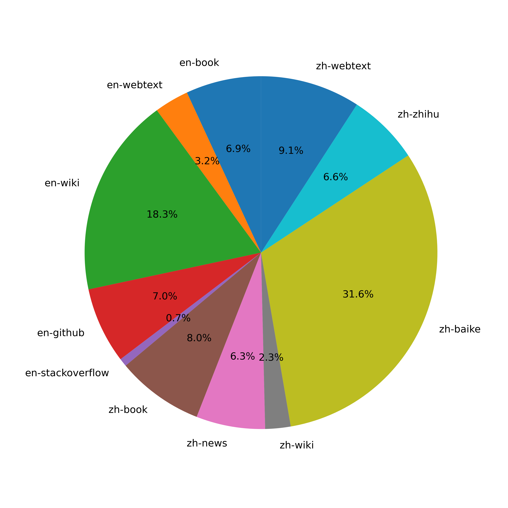
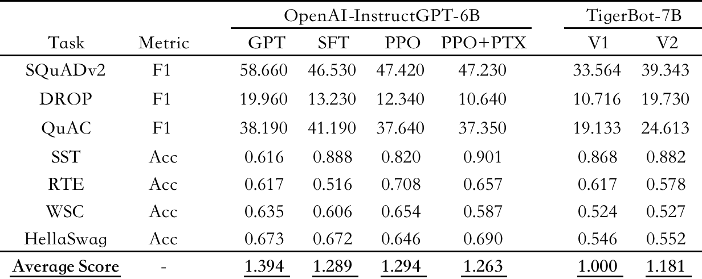

# TigerBot

<p align="center" width="100%">
</a>
</p>

## 最近更新

## 目录

- [环境安装](#环境安装)
- [模型下载](#模型下载)
- [训练和推理](#训练和推理)
- [开源数据集](#开源数据集)
- [测评](#测评)
- [API](#API)
- [案例](#案例)

## 环境安装

```bash

conda create --name tigerbot python=3.8
conda activate tigerbot
conda install pytorch torchvision torchaudio pytorch-cuda=11.7 -c pytorch -c nvidia

git clone https://github.com/TigerResearch/TigerBot
cd TigerBot
pip install -r requirements.txt
```

## 模型下载

<summary>Tigerbot-7B</summary>

| Tigerbot-7B                                    | Bits | memory(GB) |
| ---------------------------------------------- | ---- | ---------- |
| [Tigerbot-7B-base](https://huggingface.co)     | 16   | 17.2       |
| [Tigerbot-7B-sft](https://huggingface.co)      | 16   | 17.2       |
| [Tigerbot-7B-sft-int4](https://huggingface.co) | 4    | 8.5        |

<summary>Tigerbot-176B)</summary>

| Tigerbot-176B                                    | Bits | memory(GB) |
| ------------------------------------------------ | ---- |------------|
| [Tigerbot-176B-sft](https://huggingface.co)      | 16   | 347.6      |
| [Tigerbot-176B-sft-int4](https://huggingface.co) | 4    |            |

## 训练和推理

### 预训练

启动训练前安装 DeepSpeed

```
git clone https://github.com/microsoft/DeepSpeed/
cd DeepSpeed
rm -rf build
TORCH_CUDA_ARCH_LIST="8.0" DS_BUILD_CPU_ADAM=1 DS_BUILD_UTILS=1 pip install . \
--global-option="build_ext" --global-option="-j8" --no-cache -v \
--disable-pip-version-check 2>&1 | tee build.log
```

TORCH_CUDA_ARCH_LIST 根据你运行的 GPU 架构做调整，获取 TORCH_CUDA_ARCH_LIST

```
CUDA_VISIBLE_DEVICES=0 python -c "import torch; print(torch.cuda.get_device_capability())"
```

如果返回的结果是(8, 0)，那么 TORCH_CUDA_ARCH_LIST="8.0"

#### 启动训练

```
deepspeed \
--include="localhost:0,1,2,3" \
./train_clm.py \
--deepspeed ./ds_config/ds_config_zero3.json \
--model_name_or_path ./tigerbot_560m \
--dataset_name TigerResearch/dev_pretrain \
--do_train \
--output_dir ./ckpt-clm \
--overwrite_output_dir \
--preprocess_num_workers 8 \
--num_train_epochs 5 \
--learning_rate 1e-5 \
--evaluation_strategy steps \
--eval_steps 10 \
--bf16 True \
--save_strategy steps \
--save_steps 10 \
--save_total_limit 2 \
--logging_steps 10 \
--tf32 True \
--per_device_train_batch_size 2 \
--per_device_eval_batch_size 2
```

### 微调

#### 启动训练

```
deepspeed \
--include="localhost:0,1,2,3" \
./train_sft.py \
--deepspeed ./ds_config/ds_config_zero3.json \
--model_name_or_path ./tigerbot_560m \
--dataset_name TigerResearch/dev_sft \
--do_train \
--output_dir ./ckpt-sft \
--overwrite_output_dir \
--preprocess_num_workers 8 \
--num_train_epochs 5 \
--learning_rate 1e-5 \
--evaluation_strategy steps \
--eval_steps 10 \
--bf16 True \
--save_strategy steps \
--save_steps 10 \
--save_total_limit 2 \
--logging_steps 10 \
--tf32 True \
--per_device_train_batch_size 2 \
--per_device_eval_batch_size 2
```

### 推理

#### 单卡推理

```
CUDA_VISIBLE_DEVICES=0 python infer ${MODEL_DIR}
```

#### 多卡推理

```
CUDA_VISIBLE_DEVICES=0,1,2,3 python infer ${MODEL_DIR}
```

### 量化

我们使用[GPTQ](https://github.com/IST-DASLab/gptq)算法和[GPTQ-for-LLaMa](https://github.com/qwopqwop200/GPTQ-for-LLaMa)实现量化：

```
cd gptq

# Save compressed model
CUDA_VISIBLE_DEVICES=0 python llama.py ${MODEL_DIR} c4 --wbits 4 --act-order --groupsize 128 --save tigerbot-4bit-128g.pt
```

#### 量化模型单卡推理

```
CUDA_VISIBLE_DEVICES=0 python infer ${MODEL_DIR} --wbits 4 --groupsize 128 --load tigerbot-4bit-128g.pt
```

#### 量化模型多卡推理

```
CUDA_VISIBLE_DEVICES=0,1 python infer ${MODEL_DIR} --wbits 4 --groupsize 128 --load tigerbot-4bit-128g.pt
```

## 开源数据集

### 预训练数据

- 中英自然语言文本，当前开源总量105G（以下数据集开放到 huggingface）

  | 类型                                   |  磁盘占用 |  来源 |
  | ------------------------------------- |------------| ---|
  | [中文书籍](https://huggingface.co)     | 12G      |  自研
  | [中文互联网](https://huggingface.co)   | 25G      |  自研
  | [中文百科](https://huggingface.co)     | 19G      |  自研
  | [英文书籍](https://huggingface.co)     | 22G      |  开源
  | [英文互联网](https://huggingface.co)   | 6.9G     |   开源
  | [英文百科](https://huggingface.co)     | 22G      |  开源
  | **总量**   | **105G**     |  


- 完整预训练数据占比如图所示:



- 中文书籍及代码细分:

<p width="100%">
    
</p>


### 微调数据

#### 数据搜集

- 模型中使用的微调数据的搜集思想如下：

  a. 参考Alpaca,扩充中英文seed_tasks,增加一些中文习惯种子问题，基于此生成2m中文(本次开源0.5m)及0.1m(本次开源50k)
  
  b. 基于人工写题及答案、网络搜集方式，整理加工问答集数据，在开源列表中标识为[自研]部分，本次开放部分数据
  
  c. 基于各类公开数据集转换清洗，其中[自研*]部分，表示基于原始数据进行二次开发后得到，[开源]部分数据集一般原始数据即为较规整的问答数据，进行简单清洗得到

#### 数据开源
- 指令数据集, 当前开源120W问答对，磁盘空间1.1G (数据集开放到 huggingface）

    | 类型          | 语言 |  数据集 |  数量 | 来源 |
    | --------------------------------|--- | ------------| ---| --- | 
    | alpaca中文| 中文| [tiger-alpaca-zh-0.5m](https://huggingface.co) | 0.5m | 自研 
    | 脑筋急转弯 | 中文| [tiger-think-more-zh-1k](https://huggingface.co) | 1k | 自研
    | 百科问答 | 中文| [tiger-wiki-qa-1k](https://huggingface.co)  | 1k | 自研
    | 名著问答 | 中文| [tiger-book-qa-1k](https://huggingface.co)  | 1k | 自研
    | 阅读理解 | 中文|  [superclue-c3-zh-5k](https://huggingface.co) | 5k | 自研*
    | 问答 |中文|   [HC3-zh-12k](https://huggingface.co) | 12k | 开源
    | 知乎问答|中文|   [zhihu-zh-10k](https://huggingface.co) | 10k| 开源
    | alpaca英文| 英文 |[tiger-alpaca-en-50k](https://huggingface.co) | 50k | 自研
    | 头脑风暴 | 英文| [dolly-Brainstorming-en-1.7k](https://huggingface.co) | 1.7k | 开源
    | 分类 |英文|  [dolly-Classification-en-2k](https://huggingface.co) | 2k  | 开源
    | 数学问题 | 英文| [gsm-8k-en](https://huggingface.co) | 8k  | 开源
    | 代码 | 英文| [kaggle-leetcodesolutions-en-2k](https://huggingface.co) | 2k  | 自研*
    | 食谱生成 |英文| [kaggle-recipes-en-2k](https://huggingface.co) | 2k  | 开源
    | 病历生成 | 英文| [mt-note-generation-en](https://huggingface.co) | 450  | 开源
    | 多轮对话 |英文| [OIG-multichat-en-50k](https://huggingface.co) | 50k  | 自研*
    | 综合问答 |英文|[stackexchange-qa-en-0.5m](https://huggingface.co) | 0.5m  | 开源
    | wiki问答| 英文| [wiki-qa-bart-en-10k](https://huggingface.co)|10k | 开源
    | 如何做类教程| 英文| [youtube-howto-en-50k](https://huggingface.co) | 50k | 开源
    | **总量**   |  |   | **120W条**     | 
    
  > 其中[自研*]类的表搜集公开数据进行人工加工、清洗、转换后形成新的数据集

  > 更多数据集陆续整理开放中...
  

### 领域数据


- 开放金融、法律、百科相关领域数据，作为rethink外部数据源

  | 类型 |  数量 |
  | ---------- |------------|
  |[金融-研报](https://huggingface.co)   | 5000篇
  |[金融-财报](https://huggingface.co)  |  5000篇 
  |[法律](https://huggingface.co)     | 1部(刑法）
  |[百科](https://huggingface.co)   |  10W词条


## 测评

在7项传统NLP任务上进行模型测评，以OpenAI-InstructGPT-6B-SFT为基准，归一化并平均各模型的得分，结果如下：



## API

#### Authentication

获取唯一标识：API_KEY, 所有的 api 接口都需要用到

#### 对话（Chat-API）

<details><summary><b>Example request</b></summary>

```python
import requests

url = "https://api.tigerbot.com/bot-service/ai_service/gpt"

headers = {
    'Authorization': 'Bearer ' + API_KEY
}

payload = {
    "text": "中国的首都",
    "modelVersion": "tigerbot-gauss"
}

response = requests.post(url, headers=headers, json=payload)
print(response.text)
```

```json
{
  "code": 200,
  "msg": "操作成功",
  "data": {
    "result": ["北京"]
  }
}
```

</details>

### 插件（Plug-ins）

#### Rethink

TigerBot 提供的一种辅助性外脑搜索方式

<details><summary><b>Example request</b></summary>

```python
import requests

uri = "https://api.tigerbot.com/bot-service/ai_service/rethink"

headers = {
    'Authorization': 'Bearer ' + API_KEY
}

payload = {
    "text": "刘德华与梁朝伟合演的电影",
    "pluginName": "wiki"
}

response = requests.post(uri, headers=headers, json=payload)

print(response.text)
```

```json
{
  "code": 200,
  "msg": "操作成功",
  "data": {
    "result": ["刘德华与 梁朝伟合拍的电影有《无间道》和《花样年 华》。"]
  }
}
```

</details>

##### Custom Rethink

自定义自己的知识库，提供自己专属的外脑搜索

<details><summary><b>Rethink 创建</b></summary>

```python
import requests

url = "https://api.tigerbot.com/bot-service/plugin/custom/create_plugin"

headers = {
    'Authorization': 'Bearer ' + API_KEY
}
payload = {
    'name': 'Your pluginName'
}

response = requests.post(url, headers=headers, json=payload)

print(response.text)
```

```json
{
  "code": 200,
  "msg": "操作成功",
  "data": {
    "pluginId": "pls3862",
    "name": "api_test_v1",
    "canUse": false,
    "createTime": "2023-05-13 15:29:49"
  }
}
```

</details>

<details><summary><b>Datasets 导入</b></summary>

```python
import requests

url = "https://api.tigerbot.com/bot-service/plugin/custom/add_dataset"

headers = {
    'Authorization': 'Bearer ' + API_KEY
}

payload = {
    'pluginId': "Your pluginId"
}

your_json_file_path = '/Users/rethink/data.json'

files = {'file': open(your_json_file_path, 'rb')}

response = requests.post(url, headers=headers, data=payload, files=files)

print(response.text)

```

```json
{
  "code": 200,
  "msg": "操作成功",
  "data": {
    "datasetId": 1821
  }
}
```

</details>

<details><summary><b> Rethink 使用</b></summary>

```python
import requests

url = "https://api.tigerbot.com/bot-service/plugin/custom/rethink"

headers = {
    'Authorization': 'Bearer ' + API_KEY
}

payload = {
    'pluginId': 'Your pluginId',
    'text': '被家暴了怎么办',
    'stopOnEmptyData': False
}

response = requests.post(url, headers=headers, json=payload)

print(response.text)

```

```json
{
  "code": 200,
  "msg": "操作成功",
  "data": {
    "result": [
      "首先，要及时向警方报案，提供详细的信息和证据，协助警方调查取证。同时，要及时就医，并按照医生的建议进行治疗。如果情况严重，可以考虑向法院起诉，寻求法律保护。此外，可以向专业机构寻求帮助，如心理咨询师、社工等，以获得更多的支持和指导。"
    ]
  }
}
```

</details>

<details><summary><b>Datasets 列表</b></summary>

```python
import requests

url = "https://api.tigerbot.com/bot-service/plugin/custom/get_dataset_list"

headers = {
    'Authorization': 'Bearer ' + API_KEY
}

payload = {
    'pluginId': 'Your pluginId'
}

response = requests.post(url, headers=headers, json=payload)

print(response.text)

```

```json
{
  "code": 200,
  "msg": "操作成功",
  "data": {
    "list": [
      {
        "pluginId": "pls3862",
        "dataId": 1820,
        "processStatus": 5,
        "processStatusName": "已成功",
        "msg": "",
        "fileUrl": "https://x-pai.algolet.com/common/u/11/2305/2023/13/c93a783e657f7114aed66db8be31746c.json?Expires=1841645361&OSSAccessKeyId=LTAI5t8HoYusAPr5MffHTauz&Signature=OhfzUAzZJ%2BRoD1ui22w3jVu%2BzwA%3D",
        "fileName": "社会法.json",
        "createTime": "2023-05-13 16:09:23"
      }
    ],
    "pageNum": 1,
    "pageSize": 20,
    "total": 1,
    "hasMore": false
  }
}
```

</details>

<details><summary><b>Rethinks 列表</b></summary>

```python
import requests

url = "https://api.tigerbot.com/bot-service/plugin/custom/get_user_plugin_list"

headers = {
    'Authorization': 'Bearer ' + API_KEY
}

payload = {
    'pageNum': 1,
    'pageSize': 2
}

response = requests.post(url, headers=headers, json=payload)

print(response.text)

```

```json
{
  "code": 200,
  "msg": "操作成功",
  "data": {
    "list": [
      {
        "id": "pls3860",
        "name": "api0512Test",
        "canUse": true,
        "createTime": "2023-05-12 23:39:15"
      },
      {
        "id": "pls3861",
        "name": "api0513Test",
        "canUse": true,
        "createTime": "2023-05-13 11:59:45"
      }
    ],
    "pageNum": 1,
    "pageSize": 0,
    "total": 7,
    "hasMore": true
  }
}
```

</details>

### 微调（Fine-Tunes）【[Datasets 样例](https://x-pai.algolet.com/bot/fine_tune/example.json?OSSAccessKeyId=sauBoVUnLI0kHXam&Expires=2044204946&Signature=czP1qqq3KCRm3YO5jniGzRaAGBw%3D)】

<details><summary><b>fine-tune 创建</b></summary>

```python
import requests

url = "https://api.tigerbot.com/bot-service/ft/upload_train_data"

headers = {
    'Authorization': 'Bearer ' + API_KEY
}

your_json_file_path = '/Users/fine_tuning/data.json'

files = {'file': open(your_json_file_path, 'rb')}

response = requests.post(url, headers=headers, files=files)

print(response.text)
```

```json
{
  "code": 200,
  "msg": "操作成功",
  "data": {
    "ftId": "ft2",
    "name": "my_fine_tune0514",
    "dataset": {
      "fileName": "data_sample.json",
      "url": "https://x-pai.algolet.com/common/ft_u/11/2023/14/7719f1a15bf8356e5cca1367b7f9e07a.json?Expires=1841749770&OSSAccessKeyId=LTAI5t8HoYusAPr5MffHTauz&Signature=LllW3b5EYZ5vsxn344LWnXLPjAc%3D"
    },
    "createTime": "2023-05-14 20:41:57",
    "status": 2,
    "statusName": "训练中",
    "serviceStatus": 0,
    "serviceStatusName": "未上线",
    "msg": ""
  }
}
```

</details>

<details><summary><b>fine-tune 训练</b></summary>

```python
import requests

url = "https://api.tigerbot.com/bot-service/ft/start_train"

headers = {
    'Authorization': 'Bearer ' + API_KEY
}

payload = {
    'ftId': 'Your ftId'
}

response = requests.post(url, headers=headers, json=payload)

print(response.text)

```

```json
{
  "code": 200,
  "msg": "操作成功",
  "data": null
}
```

</details>

<details><summary><b>fine-tune 使用</b></summary>

```python
import requests

url = "https://api.tigerbot.com/bot-service/ft/call"

headers = {
    'Authorization': 'Bearer ' + API_KEY
}
payload = {
    'ftId': 'Your ftId',
    'text': '将以下中文翻译为英文：对此美国的政策制定者目前陷入了困境：一方面要促进增长，另一方面又得降低总债务水平'
}

response = requests.post(url, headers=headers, json=payload)

print(response.text)
```

```json
{
  "code": 200,
  "msg": "操作成功",
  "data": {
    "result": [
      "The dilemma facing US policymakers is how to stimulate growth while lowering the level of total debt."
    ]
  }
}
```

</details>

<details><summary><b>fine-tune 下线</b></summary>

```python
import requests

url = "https://api.tigerbot.com/bot-service/ft/offline"

headers = {
    'Authorization': 'Bearer ' + API_KEY,
}

payload = {
    'ftId': 'Your ftId'
}
response = requests.post(url, headers=headers, json=payload)

print(response.text)
```

```json
{
  "code": 200,
  "msg": "操作成功",
  "data": null
}
```

</details>

<details><summary><b>fine-tune 列表</b></summary>

```python
import requests

url = "https://api.tigerbot.com/bot-service/ft/get_fine_tune_list"

headers = {
    'Authorization': 'Bearer ' + API_KEY
}

payload = {
    'pageNum': 1,
    'pageSize': 5
}

response = requests.post(url, headers=headers, json=payload)

print(response.text)
```

```json
{
  "code": 200,
  "msg": "操作成功",
  "data": {
    "list": [
      {
        "ftId": "ft1",
        "name": "wsen_01",
        "dataset": {
          "fileName": "data_sample.json",
          "url": "https://x-pai.algolet.com/common/ft_u/11/2023/14/7719f1a15bf8356e5cca1367b7f9e07a.json?Expires=1841737900&OSSAccessKeyId=LTAI5t8HoYusAPr5MffHTauz&Signature=XAR3x7BL5szqZ9QfMHJPuENf56o%3D"
        },
        "createTime": "2023-05-14 17:18:38",
        "status": 2,
        "statusName": "训练中",
        "serviceStatus": 0,
        "serviceStatusName": "未上线",
        "msg": ""
      },
      {
        "ftId": "ft2",
        "name": "my_fine_tune0514",
        "dataset": null,
        "createTime": "2023-05-14 20:41:57",
        "status": 2,
        "statusName": "训练中",
        "serviceStatus": 0,
        "serviceStatusName": "未上线",
        "msg": ""
      }
    ],
    "pageNum": 1,
    "pageSize": 5,
    "total": 2,
    "hasMore": false
  }
}
```

</details>

## 案例

<details><summary><b>编码</b></summary>


</details>

<details><summary><b>论文大纲</b></summary>


</details>

<details><summary><b>常识问答</b></summary>


</details>

<details><summary><b>领域问答</b></summary>


</details>
