# TigerBot

<p align="center" width="100%">
</a>
</p>
<p align="center">
<font face="黑体" size=5"> A cutting-edge foundation for your very own LLM. </font>
</p>
<p align="center">
   🌐 <a href="https://tigerbot.com/" target="_blank">TigerBot</a> • 🤗 <a href="https://huggingface.co/TigerResearch" target="_blank">Hugging Face</a>
</p>
<h4 align="left">
    <p>
        <b>English</b> |
        <a href="https://github.com/TigerResearch/TigerBot/blob/main/README.md">Chinese</a>
    <p>
</h4>

## News

TigerBot is a multi-language and multitask LLM. We evaluated our MVP model on public NLP datasets and found that our
model reached 96% of performance of OpenAI InstructGPT at the same model size. We hereby open-source our explorations as following:

- Model：TigerBot-7B, TigerBot-7B-base，TigerBot-180B (research version),
- Code:
    1. The whole training process codes including model pretraining and supervised fine-tuning.
    2. Model quantization with GPTQ.
    3. Inference on single GPU or multiple GPUs.
- Data:
    1. Pre-training data: 100GB pretraining data deduplicated and filtered low quality content from 2TB corpus.
    2. SFT data: 1GB (millions of) textual instructions. This dataset consists of 10 major user-instruction categories and 120 subcategories.
    3. Domain-specific data: We provide data into different domains: finance, law, and wikipedia.
- API: We provide APIs including chat, plugin, and finetune which allow users to create their own models and applications easily.

We pretrained and supervised fine-tuned our models, starting from a vanilla BLOOM, and made some algorithmic innovations so far:

- A stronger yet more elegant supervised learning algorithms to achieve higher learnability in supervised fine-tuning.
- We implemented a probabilistic modeling and ensemble approach to achieve better factuality and generativeness.
- We improved the memory management and multi-node communication of distributed training with deepspeed. It guarantees months of training in a thousand-gpu enviroment with zero downtime.
- We used a specialized tokenizer and supervised training algorithm better suited for otherwise more skewed Chinese language distribution.

## Contents

- [Install](#Install)
- [Model Weights](#Model-Weights)
- [Training and Inference](#Training-and-Inference)
- [Datasets](#Datasets)
- [Evaluation](#Evaluation)
- [API](#API)
- [Cases](#Cases)

## Install

```bash

conda create --name tigerbot python=3.8
conda activate tigerbot
conda install pytorch torchvision torchaudio pytorch-cuda=11.7 -c pytorch -c nvidia

git clone https://github.com/TigerResearch/TigerBot
cd TigerBot
pip install -r requirements.txt
```

## Model Weights

<summary>Tigerbot-7B</summary>

| Tigerbot-7B                                                                                 | Bits | memory(GB) |
| ------------------------------------------------------------------------------------------- | ---- | ---------- |
| [tigerbot-7b-base](https://huggingface.co/TigerResearch/tigerbot-7b-base)                   | 16   | 17.2       |
| [tigerbot-7b-sft](https://huggingface.co/TigerResearch/tigerbot-7b-sft)                     | 16   | 17.2       |
| [tigerbot-7b-sft-4bit-128g](https://huggingface.co/TigerResearch/tigerbot-7b-sft-4bit-128g) | 4    | 8.5        |

<summary>Tigerbot-180B-Research</summary>

| Tigerbot-180B-Research                                                                             | Bits | memory(GB) |
| -------------------------------------------------------------------------------------------------- | ---- | ---------- |
| [tigerbot-180b-sft](https://huggingface.co/TigerResearch/tigerbot-180b-research)                   | 16   | 347.6      |
| [tigerbot-180b-sft-4bit-128g](https://huggingface.co/TigerResearch/tigerbot-180b-research-4bit-128g) | 4    | 108.5      |

## Training and Inference

### Pre-training

Install DeepSpeed

```
git clone https://github.com/microsoft/DeepSpeed/
cd DeepSpeed
rm -rf build
TORCH_CUDA_ARCH_LIST="8.0" DS_BUILD_CPU_ADAM=1 DS_BUILD_UTILS=1 pip install . \
--global-option="build_ext" --global-option="-j8" --no-cache -v \
--disable-pip-version-check 2>&1 | tee build.log
```

Edit TORCH_CUDA_ARCH_LIST to insert the code for the architectures of the GPU cards you intend to use.

```
CUDA_VISIBLE_DEVICES=0 python -c "import torch; print(torch.cuda.get_device_capability())"
```

So if you get 8, 0, then use TORCH_CUDA_ARCH_LIST="8.0".

command to start training

```
deepspeed \
--include="localhost:0,1,2,3" \
./train_clm.py \
--deepspeed ./ds_config/ds_config_zero3.json \
--model_name_or_path TigerResearch/tigerbot-7b-base \
--dataset_name TigerResearch/dev_pretrain \
--do_train \
--output_dir ./ckpt-clm \
--overwrite_output_dir \
--preprocess_num_workers 8 \
--num_train_epochs 5 \
--learning_rate 1e-5 \
--evaluation_strategy steps \
--eval_steps 10 \
--bf16 True \
--save_strategy steps \
--save_steps 10 \
--save_total_limit 2 \
--logging_steps 10 \
--tf32 True \
--per_device_train_batch_size 2 \
--per_device_eval_batch_size 2
```

### Fine-tunes

command to start training

```
deepspeed \
--include="localhost:0,1,2,3" \
./train_sft.py \
--deepspeed ./ds_config/ds_config_zero3.json \
--model_name_or_path TigerResearch/tigerbot-7b-base \
--dataset_name TigerResearch/dev_sft \
--do_train \
--output_dir ./ckpt-sft \
--overwrite_output_dir \
--preprocess_num_workers 8 \
--num_train_epochs 5 \
--learning_rate 1e-5 \
--evaluation_strategy steps \
--eval_steps 10 \
--bf16 True \
--save_strategy steps \
--save_steps 10 \
--save_total_limit 2 \
--logging_steps 10 \
--tf32 True \
--per_device_train_batch_size 2 \
--per_device_eval_batch_size 2
```

### Inference

You can infer with command line. Input `clear` to clean history and input `exit` to stop it.

<p width="100%">
    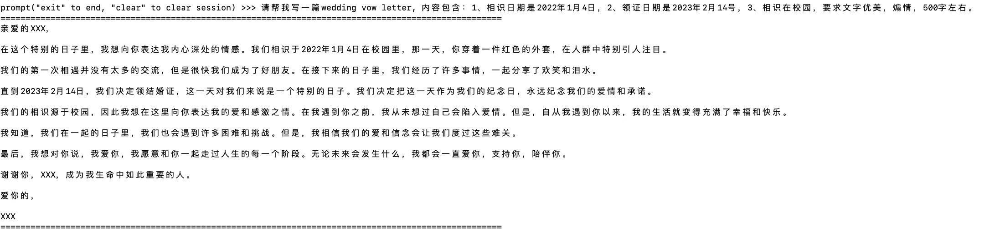
</p>

#### Infer with single GPU

`tigerbot-7b-sft` can be loaded for inference on RTX3090 GPU
```
CUDA_VISIBLE_DEVICES=0 python infer.py --model_path ${MODEL_DIR}
```

If you want to enable streaming output, please replace `infer.py` with `infer_stream.py`, and the output will change from one-shot output to sentence-by-sentence output.
```
CUDA_VISIBLE_DEVICES=0 python infer_stream.py --model_path ${MODEL_DIR}
```

If you want to enable the web interface for Q&A, change the model path corresponding to model_path on line 12 of `web_demo.py` to the path where your model is located, and then run the following command to enable the web interface.
```
CUDA_VISIBLE_DEVICES=0 python web_demo.py
```

`tigerbot-7b-base` uses continuation (non-question answering) inference code.

```
CUDA_VISIBLE_DEVICES=0 python infer_pretrain.py --model_path ${PRETRAIN_MODEL_DIR}
```

#### Infer with multiple GPUS

`tigerbot-180b-sft` can be loaded for parallelism inference on 5 A100(80G) GPUs

```
CUDA_VISIBLE_DEVICES=0,1,2,3,4 python infer.py --model_path ${MODEL_DIR}
```

### Quantization

We use [GPTQ](https://github.com/IST-DASLab/gptq) and [GPTQ-for-LLaMa](https://github.com/qwopqwop200/GPTQ-for-LLaMa) to
quantize models.

go to the path of gptq

```
cd gptq
```

#### Model quantization

```
CUDA_VISIBLE_DEVICES=0 python tigerbot.py ${MODEL_DIR} c4 --wbits 4 --act-order --groupsize 128 --save ${MODEL_DIR}/tigerbot-7b-4bit-128g.pt
```

#### Quantized model infer with single GPU

[`tigerbot-7b-sft-4bit-128g`](https://huggingface.co/TigerResearch/tigerbot-7b-sft-4bit-128g) can be loaded for
inference on RTX3090 GPU

```
CUDA_VISIBLE_DEVICES=0 python tigerbot_infer.py ${MODEL_DIR} --wbits 4 --groupsize 128 --load ${MODEL_DIR}/tigerbot-7b-4bit-128g.pt
```

[`tigerbot-180b-research-4bit-128g`](https://huggingface.co/TigerResearch/tigerbot-180b-research-4bit-128g) can be
loaded for parallelism inference on 2 A100(80G) GPUs

```
CUDA_VISIBLE_DEVICES=0,1 python tigerbot_infer.py ${MODEL_DIR} --wbits 4 --groupsize 128 --load {MODEL_DIR}/tigerbot-4bit-128g.pt
```

For quantized model shards

```
CUDA_VISIBLE_DEVICES=0,1 python tigerbot_infer.py ${MODEL_DIR} --wbits 4 --groupsize 128 --load "{MODEL_DIR}/tigerbot-4bit-128g-*.pt"
```

## Datasets

### Pretraining Datasets

- <a href=https://huggingface.co/datasets/TigerResearch/pretrain_zh>Chinese Pretraining Corpus - 55G [hugging face]</a>
- <a href=https://huggingface.co/datasets/TigerResearch/pretrain_en>English Pretraining Corpus - 51G [hugging face]</a>

  | Type | Disk | Source |
  | ---------- | -------- | ---- |
  | zh-book | 12G | TigerBot |
  | zh-webtext | 25G | TigerBot |
  | zh-baike | 19G | TigerBot |
  | en-book | 22G | Public |
  | en-web | 6.9G | Public |
  | en-wiki | 22G | Public |
  | **Total**     | **106G** | |

- Distribution of Pre-training Data

<p align="center" width="100%">
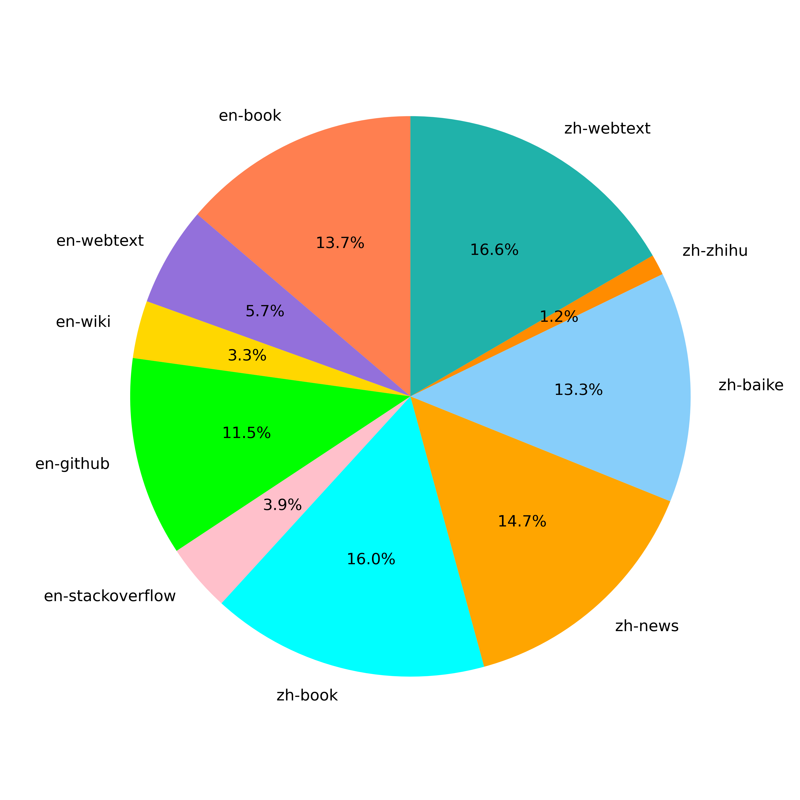</a>
</p>

- Distribution of zh-book and coding data.

<p width="100%">
    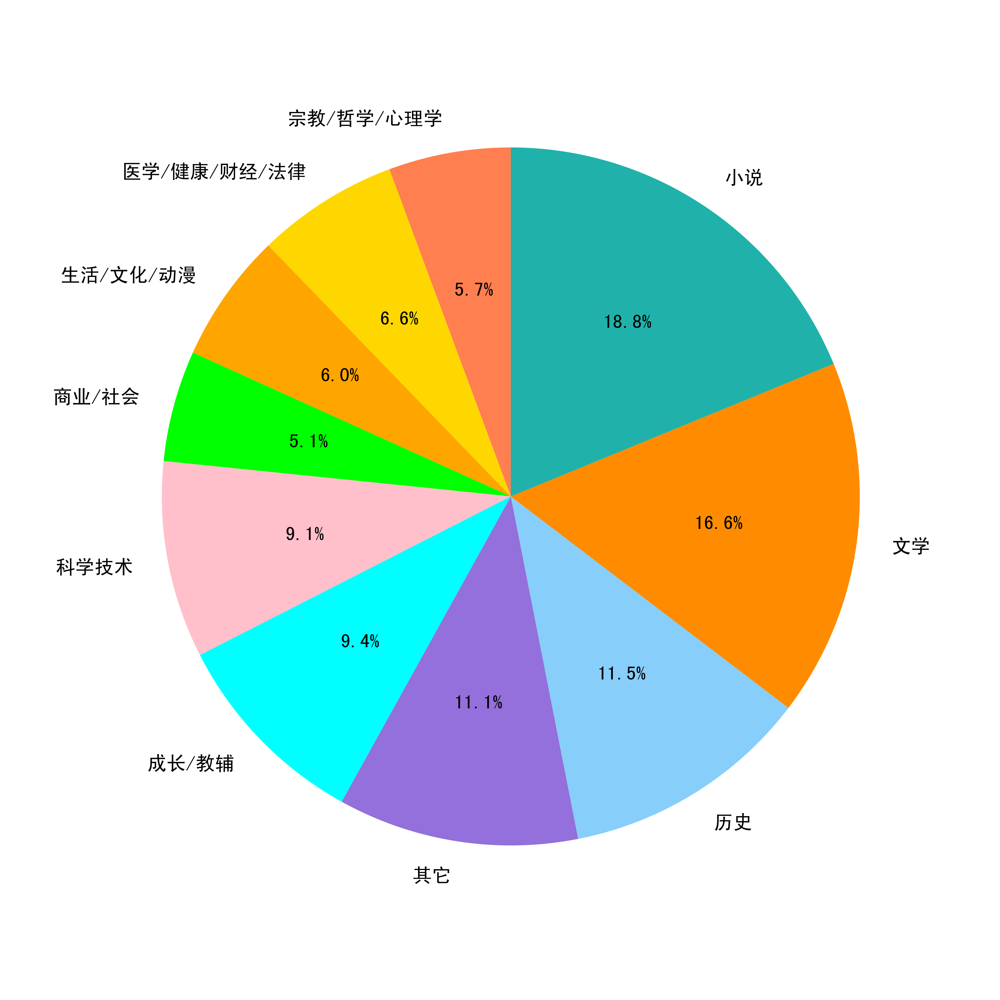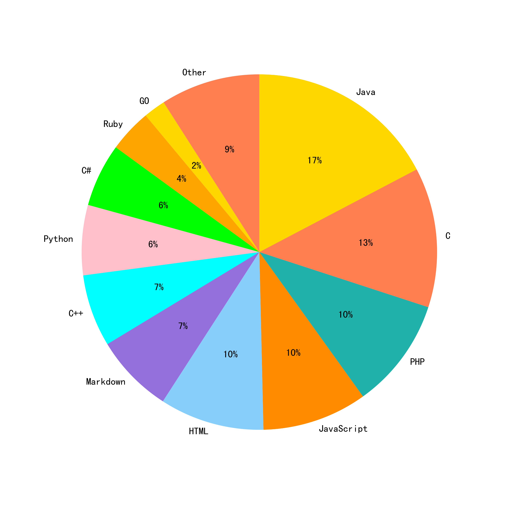
</p>

### Supervised Fine-tuning Datasets

#### Data collection
- We collect SFT data as follows:
  a. self-instruct
  b. human-labeling
  c. open-source data cleaning

#### Data cleaning
We clean and filter data as follows:
- rule-based and keyword-based ways to filter low quality and unsafe contents.
- deduplicate

#### Datasets to open source
- 1200K Instruction-following dataset (download it from huggingface)

  | Type         | Language | Dataset                                                                                                                           | Number | Source |
  |--| ---- |--------|----| ------ |
  | alpaca-zh  | zh | [tigerbot-alpaca-zh-0.5m](https://huggingface.co/datasets/TigerResearch/tigerbot-alpaca-zh-0.5m)                                 | 500K   | TigerBot |
  | wiki-qa     | zh | [tigerbot-wiki-qa-1k](https://huggingface.co/datasets/TigerResearch/tigerbot-wiki-qa-zh-1k)                                      | 1K     | TigerBot |
  | book-qa     | zh | [tigerbot-book-qa-1k](https://huggingface.co/datasets/TigerResearch/tigerbot-book-qa-1k)                                         | 1K     | TigerBot |
  | riddle-qa       | zh | [tigerbot-riddle-qa-1k](https://huggingface.co/datasets/TigerResearch/tigerbot-riddle-qa-1k)                                     | 1K     | TigerBot |
  | mrc     | zh | [tigerbot-superclue-c3-zh-5k](https://huggingface.co/datasets/TigerResearch/tigerbot-superclue-c3-zh-5k)                         | 5K     | TigerBot |
  | HC3-qa         | zh | [tigerbot-HC3-zh-12k](https://huggingface.co/datasets/TigerResearch/tigerbot-HC3-zh-12k)                                         | 12K    | Public |
  | zhihu-qa     | zh | [tigerbot-zhihu-zh-10k](https://huggingface.co/datasets/TigerResearch/tigerbot-zhihu-zh-10k)                                     | 10K    | Public   |
  | alpaca-en  | en | [tigerbot-alpaca-en-50k](https://huggingface.co/datasets/TigerResearch/tigerbot-alpaca-en-50k)                                   | 50K    | TigerBot |
  | brainstorm     | en | [tigerbot-dolly-Brainstorming-en-1.7k](https://huggingface.co/datasets/TigerResearch/tigerbot-dolly-Brainstorming-en-1.7k)       | 1.7K   | Public   |
  | classify         | en | [tigerbot-dolly-Classification-en-2k](https://huggingface.co/datasets/TigerResearch/tigerbot-dolly-Classification-en-2k)         | 2K     | Public |
  | math     | en | [tigerbot-gsm-8k-en](https://huggingface.co/datasets/TigerResearch/tigerbot-gsm-8k-en)                                           | 8K     | Public |
  | code         | en | [tigerbot-kaggle-leetcodesolutions-en-2k](https://huggingface.co/datasets/TigerResearch/tigerbot-kaggle-leetcodesolutions-en-2k) | 2K     | TigerBot |
  | recipe     | en | [tigerbot-kaggle-recipes-en-2k](https://huggingface.co/datasets/TigerResearch/tigerbot-kaggle-recipes-en-2k)                     | 2K     | Public |
  | medical-note     | en | [tigerbot-mt-note-generation-en](https://huggingface.co/datasets/TigerResearch/tigerbot-mt-note-generation-en)                   | 0.45K  | Public |
  | multi-run   | en | [tigerbot-OIG-multichat-en-50k](https://huggingface.co/datasets/TigerResearch/tigerbot-OIG-multichat-en-50k)                     | 50K    | TigerBot |
  | general     | en | [tigerbot-stackexchange-qa-en-0.5m](https://huggingface.co/datasets/TigerResearch/tigerbot-stackexchange-qa-en-0.5m)             | 500K    | Public |
  | wiki-qa    | en | [tigerbot-wiki-qa-bart-en-10k](https://huggingface.co/datasets/TigerResearch/tigerbot-wiki-qa-bart-en-10k)                       | 10K     | Public |
  | youtube-howto | en | [tigerbot-youtube-howto-en-50k](https://huggingface.co/datasets/TigerResearch/tigerbot-youtube-howto-en-50k)                     | 50K     | Public |
  | **Total**     |  |                                                                                                                                  | **1200K** |


### Domain-specific Data
- Domain-specific Data for Plugins

  | Type                                                                                       | Number        |
  |-----------------------------------------------------------------------------------------|-------------------|
  | [Finance-Research](https://huggingface.co/datasets/TigerResearch/tigerbot-research-plugin) | 5K       |
  | [Finance-Earning](https://huggingface.co/datasets/TigerResearch/tigerbot-earning-plugin)         | 1K       |
  | [Law](https://huggingface.co/datasets/TigerResearch/tigerbot-law-plugin)                    | 550K |
  | [Wiki](https://huggingface.co/datasets/TigerResearch/tigerbot-wiki-plugin)                   | 100K     |

## Evaluation
We evaluate our SFT models on seven public NLP datasets, and compare these with OpenAI-InstructGPT. 
Results against OpenAI-InstructGPT-6B-SFT.

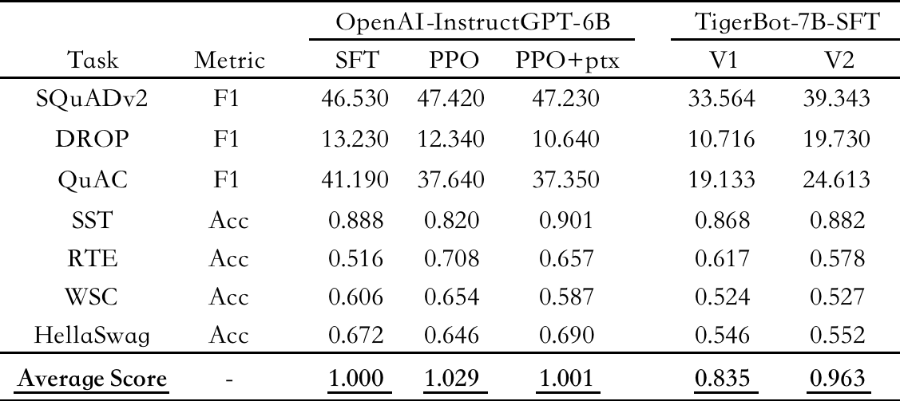

We evaluate our Pretrained models on seven public NLP datasets.
Results against bloom-7b1.

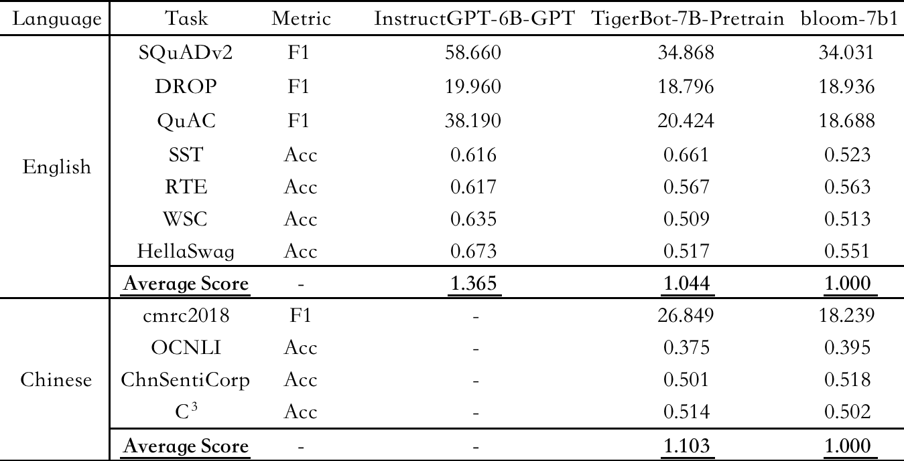

## API

TigerBot provide APIs including Chat-API，Plug-ins，Fine-Tunes.

### How to Use APIs

```python
import requests

url = "https://api.tigerbot.com/bot-service/ft/call"

headers = {
    'Authorization': 'Bearer ' + API_KEY
}
payload = {
    'ftId': 'Your ftId',
    'text': '将以下中文翻译为英文：对此美国的政策制定者目前陷入了困境：一方面要促进增长，另一方面又得降低总债务水平'
}

response = requests.post(url, headers=headers, json=payload)

print(response.text)

```

```json
{
  "code": 200,
  "msg": "操作成功",
  "data": {
    "result": [
      "The dilemma facing US policymakers is how to stimulate growth while lowering the level of total debt."
    ]
  }
}
```

### [Authentication](https://www.tigerbot.com/api-reference/authentication)

You can apply API on TigerBot
- [Apply](https://www.tigerbot.com)
- [Get API_KEY](https://www.tigerbot.com/api-reference/my-api-key)

<!-- ### 快速使用 【[完整文档](https://www.tigerbot.com/api-reference)】 -->
<!-- ### 快速使用 【[完整文档](https://www.tigerbot.com/api-reference)】 -->
### [Chat-API](https://www.tigerbot.com/api-reference/request)
You can use Tigerbot-7B or Tigerbot-180B by Chat-API

### [Plug-ins](https://www.tigerbot.com/api-reference/plugins-common)
- [Rethink](https://www.tigerbot.com/api-reference/plugins-common)
- [Custom Rethink](https://www.tigerbot.com/api-reference/plugins-custom-create)

### [Fine-Tunes](https://www.tigerbot.com/api-reference/fine-tune-add-datasets)
Tailor a model to your specific training data

## Cases

<details><summary><b>Chat Cases</b></summary>

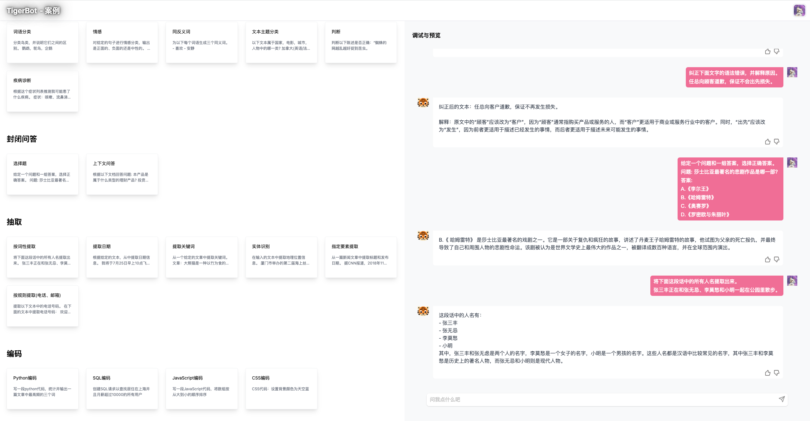
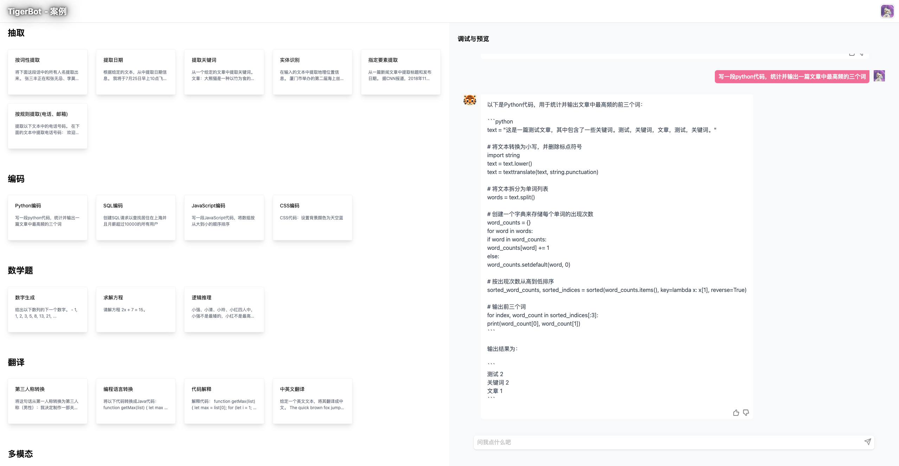
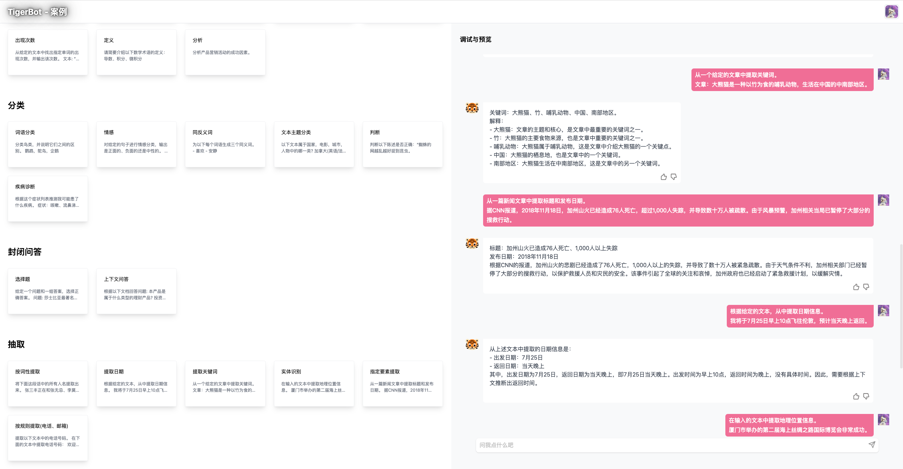
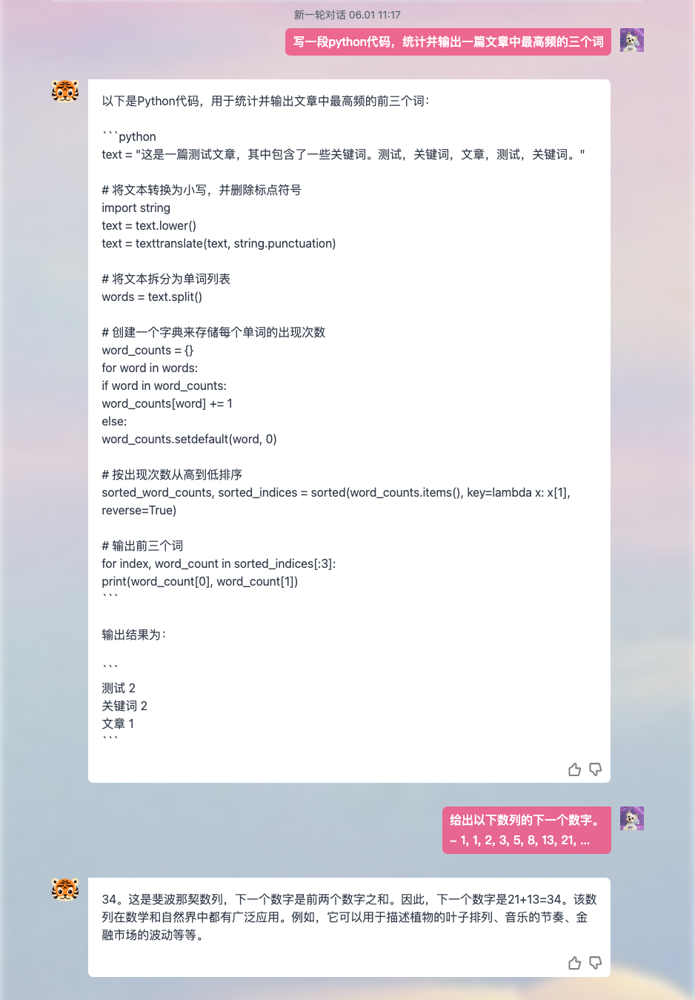
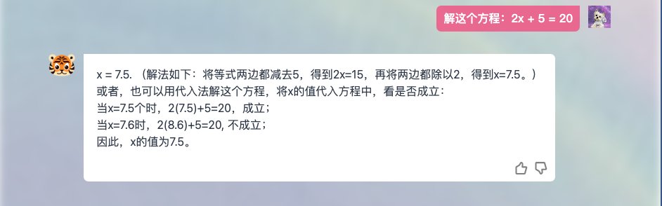
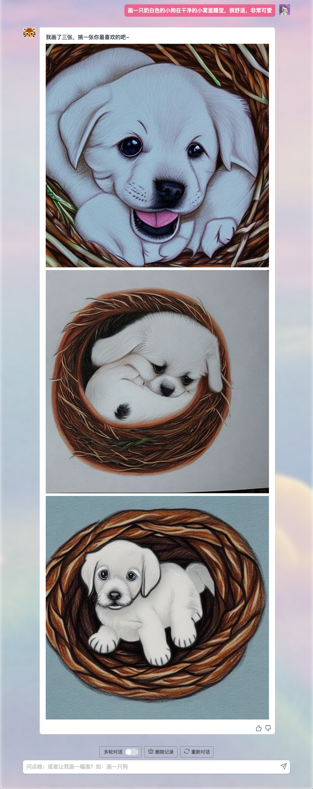

</details>

## Join Us

#### Our product

https://www.tigerbot.com

#### Tel us

021-63888086

#### Email us

<p>cong.fu@tigerbot.com</p>
<p>wei.cai@tigerbot.com</p>

#### Wechat

</a>

## Limitations and Disclaimers
Current models may contain hallucinatory, misleading, or discriminatory content. 
Please use the content generated by TigerBot series models with caution, and do not spread the generated harmful content.

The project developer is not responsible for any harm or loss caused by the use of this project 
(including but not limited to data, models, codes, etc.).
