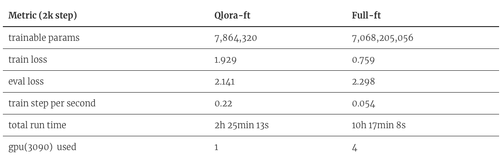

# TigerBot

<p align="center" width="100%">
</img>
</p>
<p align="center">
<font face="黑体" size=5"> A cutting-edge foundation for your very own LLM. </font>
</p>
<p align="center">
<font face="黑体" color=orange size=5"> World-Class Foundational Model，Contributes to Chinese-Style Innovation </font>
</p>
<p align="center">
   🌐 <a href="https://tigerbot.com/" target="_blank">TigerBot</a> • 🤗 <a href="https://huggingface.co/TigerResearch" target="_blank">Hugging Face</a> • 💻<a href="https://modelscope.cn/organization/TigerResearch" target="_blank">ModelScope</a>
</p>
<div align="center">

[](https://github.com/internLM/OpenCompass/)

</div>
<h4 align="left">
    <p>
        <b>English</b> |
        <a href="https://github.com/TigerResearch/TigerBot/blob/main/README.md">Chinese</a>
    <p>
</h4>

## News

- [12/29/2023] Tigerbot has published our technical report, to share our approach with technical details and experiences in application deployment。:fire: [[paper](https://arxiv.org/abs/2312.08688)]

- [12/08/2023] Tigerbot family releases updated models - bigger and better :fire: [[Model Download](#Model-Download)][[Evaluation](#Evaluation)]

	- Tigerbot-70b base (v2) and chat (v4) updated, chat model's comprehensive ability increased by 19% compared to the previous version;
	- Tigerbot-13b base (v3) and chat (v5) updated, chat model's comprehensive ability increased by 16% compared to the previous version;
	- Tigerbot-180b base and chat (v2) updated, base model is 7% better than Bloom, chat model is 20% better than Bloomz/Bloomz-mt;
	- Training data: 500B tokens pre-trained data, knowledge截止 to August 2023. More high-quality data, including: tens of thousands of volumes, arXiv, Chinese textbooks, legal and patent data;
	- Sequence length: Tigerbot-70b-chat and Tigerbot-13b-chat launched training versions with a sequence length of 4k, and inference can be extrapolated to 32k;
	- Training method: Pre-training optimized TP/PP algorithm, alignment used grouped sft, rejection-sampling, dpo (will share technical report later);
	- The entire product line (web, app, mini program) and API have been upgraded to the latest and most powerful Tigerbot-70b-chat-v4-4k, and the product side has added search (search addition) and document (file enhancement) RAG functionality.

- [10/19/2023] Long(16k)-Tigerbot Released

	- Tigerbot-13/70B web/api interface supports 16k-token lengths (approximately 20k tokens, or 20 pages of pdf or word documents, which can be directly used as context input for paper-related tasks).
	- Based on the [YaRN](https://arxiv.org/pdf/2309.00071.pdf) method, during inference, RoPE representation is extrapolated by keeping high-frequency dimensions unchanged and interpolating low-frequency dimensions to handle long sequences.
	- Tigerbot has optimized the TGI framework to calculate cos/sin values separately for each request based on the input sequence length and the maximum generated sequence length, while ensuring that the total length is no more than 2048. Therefore, API users need to choose a more appropriate max_new_token parameter, and different max_new_token parameters may lead to different results.
	- Tigerbot will continue to optimize support for long sequences during the training stage in the future.

- [9/27/2023] Tigerbot-70b-chat-api released function calling capability: [[tech report](https://github.com/TigerResearch/TigerBot/wiki/TigerBot%E5%BC%80%E6%94%BE%E5%87%BD%E6%95%B0%E8%B0%83%E7%94%A8%E8%83%BD%E5%8A%9B%EF%BC%8C%E6%89%93%E5%BC%80agent%E7%9A%84%E6%97%A0%E9%99%90%E5%8F%AF%E8%83%BD)][[tigerbot-api](https://www.tigerbot.com/api-reference/chat)]

	- {user prompt, functions definition} --> TigerBot --> 3rd party API --> TigerBot --> accurate and natural answers with accurate results.
	- Although Tigerbot's training did not specifically use function calling structured extraction data, it has already demonstrated impressive understanding and extraction abilities. Therefore, we believe that with domain-specific data fine-tuning, the performance of function calling will approach production readiness.

- [9/26/2023] Tigerbot-70b-chat(v3) and Tigerbot-13b-chat(v4) updated: [[Model Download](#Model-Download)]
	- smaller batch for finer-grained gradient updates, global_batch_size=66 (pretrain_gbs=1920, v2_gbs=240).
    We believe that with high-quality data, the gbs for alignment fine-tuning can be up to ~100K tokens, resulting in more dense updates and more extensive steps, leading to lower loss (as shown in the following figure: train and validation loss).
	- Increased the quality and diversity of the alignment data, with richer content and proper formats. Based on user feedback in the previous stage, we removed some known dirty data and prompts that do not conform to natural user habits from the original alignment data;
	- Outperformed the previous version and Llama-2 in more than 10 benchmarks, achieving the current state-of-the-art results.

  <div style="display: flex; justify-content: space-between;">
    
    
  </div>

- [9/15/2023] Tigerbot-70b-chat(v2) and Tigerbot-13b-chat(v3) updated: [[Model Download](#Model-Download)]
	- Data: Used less but higher quality data, about 5M instructions to complete data, covered 100+ types of tasks, in line with natural user distribution;
	- Data alignment: Used 10K human-annotated data for multi-dimensional alignment, including factuality, creativity, richness, security, and format;
	- Evaluation: Outperformed the previous version and Llama-2 in more than 10 benchmarks, achieving SOTA results.
		
  <p align="center" width="100%">
   		
  </p>

- [9/06/2023] Tigerbot-70b released with open source and free commercial usage: [[paper](https://github.com/TigerResearch/TigerBot/wiki/TigerBot%E2%80%9070B%E5%8F%91%E5%B8%83%EF%BC%81)][[Model Download](#Model-Download)]:fire:

  - Tigerbot-70b-base: Building on the Llama-2-70b foundation, the model's overall capabilities have surpassed Llama-2-70b in 10 mainstream benchmark tests, reaching the current industry SOTA. 
    - Trained with high-quality 300 billion token multilingual data.
      - Algorithmically enhanced with GQA, flash-attn, RoPE, and holistic-training techniques.
      - The training process employed tensor/pipeline-partition technology, achieving the current SOTA reported in the Llama-2 paper.
  - Tigerbot-70b-chat: Building on the Tigerbot-70b-base foundation, 20M dialogue directives were used to complete SFT and 10K human-annotated gold sets were used for rejection sampling alignment.
  - The Tigerbot-70b-chat API has been opened for free use to educational and research developers.
  <p align="center" width="100%">
    </a>
    </a>
	</p>


- [8/25/2023] TigerBot updates the 13b-base model: [[Model Download](#Model-Download)][[Evaluation](#Evaluation)]

  - TigerBot-13B-base: The training data has been doubled to 600B tokens, with targeted additions of high-quality English and Chinese math reasoning and scientific literature datasets. Additionally, the cleaning of Chinese web datasets has been optimized in terms of format, language, and knowledgeability. In 13 mainstream benchmark evaluations, the English comprehensive ability is 5% superior to Llama-2-13b, while the Chinese ability is over 30% superior. [[Evaluation](#Evaluation)]
  - An automatic evaluation system based on opencompass has been opened to promote reproducibility. [[Evaluation](#Evaluation)]

- [8/21/2023] TigerBot releases updated 7b and 13b base/chat models: [[Model Download](#Model-Download)][[Evaluation](#Evaluation)]

  - TigerBot-7B-base [[huggingface](https://huggingface.co/TigerResearch/tigerbot-7b-base)]: Based on Llama-2-7B, it was incrementally pretrained on 300B tokens and supplemented with datasets lacking in Llama-2, such as Chinese, code, and reasoning datasets, using the holistic training method. In 13 mainstream benchmark evaluations for both English and Chinese, it surpasses Llama-2-7B by 33%, demonstrating a leading performance among similar open source models both domestically and internationally.
  - TigerBot-7B-chat [[huggingface](https://huggingface.co/TigerResearch/tigerbot-7b-chat)]: Based on TigerBot-7B-base, it was fine-tuned using 20M data covering multiple tasks for directives (SFT) and alignment with rejection sampling (RS-HIL). In 13 mainstream benchmark evaluations for both English and Chinese, it surpasses Llama-2-7B-chat by 29%, also demonstrating a leading performance among similar open source models both domestically and internationally.
  - TigerBot-13B-chat [[huggingface](https://huggingface.co/TigerResearch/tigerbot-13b-chat)]: Based on TigerBot-13B-base, it was fine-tuned using 20M data covering multiple tasks for directives (13b-v1 used 5M data), achieving a better balance in English and Chinese abilities. In 13 mainstream benchmark evaluations for both English and Chinese, it surpasses Llama-2-13B-chat by 15%, demonstrating a leading performance among similar open source models both domestically and internationally.
  - The TigerBot API has also been updated concurrently [[tigerbot-api](https://www.tigerbot.com/api-reference)].

- [8/19/2023] TigerBot inference (tigerbot.com && tigerbot-api) enable [TGI](https://github.com/huggingface/text-generation-inference), achieving 3x QPS and 2x response speed.

https://github.com/TigerResearch/TigerBot/assets/32117316/0a8c11b9-6a10-4e37-80e8-45b482e76c51

- [8/08/2023] TigerBot 2023.08 (V3) release: TigerBot is pleased to announce the release of the TigerBot-13B large model. Based on Llama-2 and with TigerBot's accumulated technology and data, this model not only maintains Llama-2's excellent English abilities but also fills the gap in its Chinese abilities, surpassing Llama-2 by 49% in various mainstream Chinese tasks. In comparison with other open source similar models, it is competitive. :fire: [[paper](https://github.com/TigerResearch/TigerBot/wiki/Tigerbot%E2%80%9013B-is-All-You-Need)] 

	- TigerBot-13B-base: Based on Llama-2-13B, it continued to be pretrained on 300B tokens and the Chinese vocabulary was expanded to 60K. Additionally, holistic training was applied during pretraining to enable the model to complete 90% of the directives directly. In mainstream English benchmark tests, it surpassed Llama-2-13B-base by 7%, while in Chinese tests, its overall ability exceeded Llama-2-13B-base by 49%. It is at the leading position among mainstream open source base models both domestically and internationally. [[Evaluation](#Evaluation)][[Model Download](#Model-Download)]
	- TigerBot-13B-chat: Based on TigerBot-13B-base, it was fine-tuned using 5M directive data and rejection sampling was applied for alignment with human needs during fine-tuning. In mainstream English benchmark tests, its score reached that of Llama-2-13B-chat, while in Chinese tests, its overall ability exceeded Llama-2-13B-chat by 47%. It is also at the leading position among mainstream open source models both domestically and internationally. The chat model can be used by running `python infer.py --model_path TigerResearch/tigerbot-13b-chat`. [[Evaluation](#Evaluation)][[huggingface](https://huggingface.co/TigerResearch/tigerbot-13b-chat)]
	- TigerBot-API: The chat and summarization APIs will automatically be upgraded to TigerBot-13B-chat. Free use is available for scientific and educational users, while prices remain unchanged for commercial developers. [[tigerbot-api](https://www.tigerbot.com/api-reference)]

- [8/03/2023] TigerBot is compatible with the OpenAI interface. [[tigerbot-api](https://www.tigerbot.com/api-reference/chat?codeLanguage=python-openai)]

- [7/26/2023] TigerBot opens its search API [[tigerbot-api](https://www.tigerbot.com/api-reference/search)]

<p align="center" width="100%">
  
</p>
		
- [7/08/2023] TigerBot 2023.07 (V2) release [[paper](https://github.com/TigerResearch/TigerBot/wiki/TigerBot-Version2)] :fire:

  - tigerbot-7b-base (v2), Fully pretrained on 1.5TB high-quality data (4 weeks of training time and ~3 million dollars in compute cost), it outperforms the equivalent Bloom and Llama models on both Chinese and English public datasets by 15-30%. [[Evaluation](#Evaluation)][[Model Download](#Model-Download)]

  - tigerbot-7b-sft (v2), Based on the base-v2 model and trained on 20 million/20G high-quality cleaned and aligned data, it outperforms the previous SFT model (sft-v1) on 9 public corpus evaluations by 9.3%. [[Evaluation](#Evaluation)][[Model Download](#Model-Download)]

    The new model can be loaded using the following code:

    ```python
    import transformers
    
    # If you have downloaded the old version, you need to specify `force_download=True` to avoid using the old cache.
    model_sft = transformers.AutoModelForCausalLM.from_pretrained('TigerResearch/tigerbot-7b-sft', force_download=True)
    model_base = transformers.AutoModelForCausalLM.from_pretrained('TigerResearch/tigerbot-7b-base', force_download=True)
    ```
  - We are hosting internet plugin which enables web browsing with tigerbot. Tigerbot utilizes some mainstream search engines and some web tools (like weather, stock, calculator) to navigate results and interact with websites. Meanwhile , you can use tigerbot chat-api with internet search switch. [[TigerBot with search mode (default off) :earth_asia:](https://www.tigerbot.com/chat)][[paper](https://github.com/TigerResearch/TigerBot/wiki/TigerBot-upgraded-with-internet-search)]
  - You can use tigerbot chat-api with streaming switch [[TigerBot](https://www.tigerbot.com/chat)][[TigerBot-API](https://www.tigerbot.com/api-reference/chat)]
  - New features in tigerbot-api, including LLM (chat, plugin, finetune), text (embedding, summarization, pdf2text), vision (text2image) [[TigerBot-API](https://www.tigerbot.com/api-reference/chat)]
  
- [6/27/2023] PEFT TigerBot with QLoRA:  finetune a tigerbot-7b-sft model on single RTX3090 with qlora, speeds up by 16 times and reduces GPI3/4, which also preventing overfitting on downstream data[[code](https://github.com/TigerResearch/TigerBot/blob/main/train/train_with_qlora.py)] [[paper](https://github.com/TigerResearch/TigerBot/wiki/PEFT-TigerBot-7b-with-QLoRA,-building-an-domain-LLM-on-one-consumer-level-GPU-in-hours)][[Model Download](#Model-Download)]

<p align="center" width="100%">
	</a>
</p>

- [6/26/2023] TigerBot now is on desktop! [Make your own chatbot with tigerbot and Svelte](#Community)，thanks to @SaraiQX ！
- [6/20/2023] How to use tigerbot api in langchian(<a href="https://github.com/TigerResearch/TigerBot/blob/main/apps/tigerbot_chatapi.py">sample code</a>) thansk to @wordweb ！

<p align="center" width="100%">
	</a>
</p>

- [6/13/2023] Plug-in api upgrades：[search results、prompt prefix and tf-idf, embedding mixture weights](#tigerbot-api)
- [6/13/2023] Fast way to [download model](#Model-Weights)
- [6/13/2023] TigerBot now is on QQ! [QQ bot based on Tigerbot with custom knowledge base](#Community)，thanks to @wordweb ！
- [6/09/2023] Stream infer and web demo，thanks to @Tlntin ！
- [6/08/2023] Run tigerBot on [colab, windows, langchain and webui](#Community), thanks to @wordweb @runfuture !


## Contents

- [Install](#Install)
- [Model Download](#Model-Download)
- [Inference](#Inference)
- [Training](#Training)
- [Evaluation](#Evaluation)
- [Datasets](#Datasets)
- [Tigerbot API](#tigerbot-api)
- [Others](#Others)

## Install

```bash

conda create --name tigerbot python=3.8
conda activate tigerbot
conda install pytorch torchvision torchaudio pytorch-cuda=11.7 -c pytorch -c nvidia

git clone https://github.com/TigerResearch/TigerBot
cd TigerBot
pip install -r requirements.txt
```

## Model Download


| Model             | Version                                                      | Architecture | Disk size (GB) | Note                      |
| ----------------- | ------------------------------------------------------------ | ------------ | -------------- | ------------------------- |
| tigerbot-70b-base | v2 [[🤗](https://huggingface.co/TigerResearch)][[🤖](https://modelscope.cn/organization/TigerResearch)] | llama-2      | 129           | From llama-2-70b weights  |
|                   | v1 [[🤗](https://huggingface.co/TigerResearch)][[🤖](https://modelscope.cn/organization/TigerResearch)] | llama-2      | 129           | From llama-2-70b weights  |
| tigerbot-70b-chat | v4-4k [[🤗]](https://huggingface.co/TigerResearch)[[🤖](https://modelscope.cn/organization/TigerResearch)] | llama-2      | 129           | From tigerbot-70b-base v2  |
|                   | v4 [[🤗]](https://huggingface.co/TigerResearch)[[🤖](https://modelscope.cn/organization/TigerResearch)] | llama-2      | 129           | From tigerbot-70b-base v2  |
|                   | v3 [[🤗]](https://huggingface.co/TigerResearch)[[🤖](https://modelscope.cn/organization/TigerResearch)] | llama-2      | 129           | From tigerbot-70b-base v1  |
|                   | v2 [[🤗](https://huggingface.co/TigerResearch)][[🤖](https://modelscope.cn/organization/TigerResearch)] | llama-2      | 129           | From tigerbot-70b-base v1  |
|                   | v1 [[🤗](https://huggingface.co/TigerResearch)] | llama-2      | 129           | From tigerbot-70b-base v1  |
| tigerbot-70b-chat-4bit | v4 [[🤗](https://huggingface.co/TigerResearch)] | llama-2      | 37           | From tigerbot-70b-chat v4|
|                        | v3 [[🤗](https://huggingface.co/TigerResearch)] | llama-2      | 37           | From tigerbot-70b-chat v3|
|                        | v2 [[🤗](https://huggingface.co/TigerResearch)] | llama-2      | 37           | From tigerbot-70b-chat v2|
|                        | v1 [[🤗](https://huggingface.co/TigerResearch)] | llama-2      | 37           | From tigerbot-70b-chat v1|
| tigerbot-13b-base | v3 [[🤗](https://huggingface.co/TigerResearch)][[🤖](https://modelscope.cn/organization/TigerResearch)] | llama-2      | 26.6           | From llama-2-13b weights  |
|                   | v2 [[🤗](https://huggingface.co/TigerResearch)][[🤖](https://modelscope.cn/organization/TigerResearch)] | llama-2      | 26.6           | From llama-2-13b weights  |
|                   | v1 [[🤗](https://huggingface.co/TigerResearch)] | llama-2      | 26.6           | From llama-2-13b weights  |
| tigerbot-13b-chat | v5-4k [[🤗](https://huggingface.co/TigerResearch)][[🤖](https://modelscope.cn/organization/TigerResearch)] | llama-2      | 26.6           | From tigerbot-13b-base v3 |
|                   | v5 [[🤗](https://huggingface.co/TigerResearch)][[🤖](https://modelscope.cn/organization/TigerResearch)] | llama-2      | 26.6           | From tigerbot-13b-base v3 |
|                   | v4 [[🤗](https://huggingface.co/TigerResearch)][[🤖](https://modelscope.cn/organization/TigerResearch)] | llama-2      | 26.6           | From tigerbot-13b-base v2 |
|                   | v3 [[🤗](https://huggingface.co/TigerResearch)][[🤖](https://modelscope.cn/organization/TigerResearch)] | llama-2      | 26.6           | From tigerbot-13b-base v2 |
|                   | v2 [[🤗](https://huggingface.co/TigerResearch)] | llama-2      | 26.6           | From tigerbot-13b-base v2 |
|                   | v1 [[🤗](https://huggingface.co/TigerResearch)] | llama-2      | 26.6           | From tigerbot-13b-base v1 |
| tigerbot-13b-chat-4bit | v5 [[🤗](https://huggingface.co/TigerResearch)] | llama-2      | 11.5           | From tigerbot-13b-chat v5-4k |
|                        | v4 [[🤗](https://huggingface.co/TigerResearch)] | llama-2      | 11.5           | From tigerbot-13b-chat v4 |
| tigerbot-7b-base  | v3 [[🤗](https://huggingface.co/TigerResearch)][[🤖](https://modelscope.cn/organization/TigerResearch)] | llama-2      | 13.9           | From llama-2-7b weights   |
|                   | v2 [[🤗](https://huggingface.co/TigerResearch)] | bloom        | 16.2           | From bloom weights        |
|                   | v1 [[🤗](https://huggingface.co/TigerResearch)] | bloom        | 16.2           | From bloom weights        |
| tigerbot-7b-chat  | v3 [[🤗](https://huggingface.co/TigerResearch)][[🤖](https://modelscope.cn/organization/TigerResearch)] | llama-2      | 13.9           | From tigerbot-7b-base v3  |
|                   | v2 [[🤗](https://huggingface.co/TigerResearch)] | bloom        | 16.2           | From tigerbot-7b-base v2  |
|                   | v1 [[🤗](https://huggingface.co/TigerResearch)] | bloom        | 16.2           | From tigerbot-7b-base v1  |
| tigerbot-7b-chat-8bit  | v3 [[🤗](https://huggingface.co/TigerResearch)] | llama-2      | 10.8           | From tigerbot-7b-chat v3  |
| tigerbot-7b-chat-4bit  | v3 [[🤗](https://huggingface.co/TigerResearch)] | llama-2      | 6.5           | From tigerbot-7b-chat v3  |
| tigerbot-180b-base | v2 [[🤗](https://huggingface.co/TigerResearch)][[🤖](https://modelscope.cn/organization/TigerResearch)] | bloom        | 347.6          | From bloom weights        |
| tigerbot-180b-chat | v2 [[🤗](https://huggingface.co/TigerResearch)][[🤖](https://modelscope.cn/organization/TigerResearch)] | bloom        | 347.6          | From tigerbot-180b-chat v2        |
|                    | v1 [[🤗](https://huggingface.co/TigerResearch)] | bloom        | 347.6          | From bloom weights        |


## Inference

### CLI

```shell
CUDA_VISIBLE_DEVICES=0 python infer.py --model_path tigerbot-13b-chat --max_input_length 1024 --max_generate_length 1024 --streaming True
```

Parameters:

- `--model_path`: Model path
- `--model_type=chat`: base/chat
- `--max_input_length=1024`: Maximum input length
- `--max_generate_length=1024`: Maximum output length
- `--rope_scaling=None`: Length extrapolation method (either "dynamic" or "yarn" supported now)
- `--rope_factor=8.0`: Extrapolation parameter
- ~~`--streaming`: Streaming output~~

You can infer with command line. Input `clear` to clean history and input `exit` to stop it.

<p width="100%">
    
</p>


### WebPage

```
export PYTHONPATH='./' ; export CUDA_VISIBLE_DEVICES=0 ; streamlit run apps/web_demo.py -- --model_path tigerbot-13b-chat
```

Parameters are the same as CLI

### Local API

Both CLI and WebPage are demo versions. [TGI](https://github.com/huggingface/text-generation-inference) has implemented engineering features such as mixed batch and request queue. If there are a large number of inference requirements, it is recommended to provide services through the TGI image.

```shell
docker run --gpus '"device=0,1,2,3"' -d -p 8080:80 \ 
           -v PATH-TO-MODEL-DIR:/model ghcr.io/huggingface/text-generation-inference:1.1.1 \
           --model-id /model --max-total-tokens=1024 --max-input-length=1024 \
           --max-batch-prefill-tokens=1024
```

Please choose suitable parameters based on the model size and hardware situation. Generally speaking, 7B/13B require A100 40G * 1, and 70B require A100 * 4.

Note that for TGI deployment services, the generation control parameters need to be controlled in each request.


### Quantization

#### ExLLaMaV2 Quantitative Inference

Use [ExLLaMaV2](https://github.com/turboderp/exllamav2a) to load [TigerResearch/tigerbot-70b-chat-v4-4bit-exl2] for inference, which will increase inference speed.

```
# Install ExLLaMaV2
git clone https://github.com/turboderp/exllamav2
cd exllamav2
pip install -r requirements.txt

# Start inference
CUDA_VISIBLE_DEVICES=0 python other_infer/exllamav2_hf_infer.py --model_path ${MODEL_PATH}
```
The `MODEL_PATH` is the path to the quantized model, such as `TigerResearch/tigerbot-70b-chat-v4-4bit-exl2`

To use the above quantization method, please upgrade packages such as transformers and bitsandbytes to the latest version (Currently, transformers==4.33.1 and bitsandbytes==0.41.1 can be used normally)

```
pip install -U transformers bitsandbytes
```

#### Dynamic Quantization Model Loading

This method is for online quantization and inference.
```
CUDA_VISIBLE_DEVICES=0 python other_infer/quant_infer.py --model_path ${MODEL_DIR} --wbit 8
```

## Training

### Pre-training

Install DeepSpeed

```
git clone https://github.com/microsoft/DeepSpeed/
cd DeepSpeed
rm -rf build
TORCH_CUDA_ARCH_LIST="8.0" DS_BUILD_CPU_ADAM=1 DS_BUILD_UTILS=1 pip install . \
--global-option="build_ext" --global-option="-j8" --no-cache -v \
--disable-pip-version-check 2>&1 | tee build.log
```

Edit TORCH_CUDA_ARCH_LIST to insert the code for the architectures of the GPU cards you intend to use.

```
CUDA_VISIBLE_DEVICES=0 python -c "import torch; print(torch.cuda.get_device_capability())"
```

So if you get 8, 0, then use TORCH_CUDA_ARCH_LIST="8.0".

#### start training

Starting the training of `tigerbot-7b` requires at least 1 x A100 (40GB), and starting `tigerbot-180b` requires at least 16 x A100 (40GB)

```
deepspeed \
--include="localhost:0,1,2,3" \
./train_clm.py \
--deepspeed ./ds_config/ds_config_zero3.json \
--model_name_or_path TigerResearch/tigerbot-7b-base \
--dataset_name TigerResearch/dev_pretrain \
--do_train \
--output_dir ./ckpt-clm \
--overwrite_output_dir \
--preprocess_num_workers 8 \
--num_train_epochs 5 \
--learning_rate 1e-5 \
--evaluation_strategy steps \
--eval_steps 10 \
--bf16 True \
--save_strategy steps \
--save_steps 10 \
--save_total_limit 2 \
--logging_steps 10 \
--tf32 True \
--per_device_train_batch_size 2 \
--per_device_eval_batch_size 2
```

### Fine-tunes

#### start training

```
deepspeed \
--include="localhost:0,1,2,3" \
./train_sft.py \
--deepspeed ./ds_config/ds_config_zero3.json \
--model_name_or_path TigerResearch/tigerbot-7b-base \
--dataset_name TigerResearch/dev_sft \
--do_train \
--output_dir ./ckpt-sft \
--overwrite_output_dir \
--preprocess_num_workers 8 \
--num_train_epochs 5 \
--learning_rate 1e-5 \
--evaluation_strategy steps \
--eval_steps 10 \
--bf16 True \
--save_strategy steps \
--save_steps 10 \
--save_total_limit 2 \
--logging_steps 10 \
--tf32 True \
--per_device_train_batch_size 2 \
--per_device_eval_batch_size 2
```

## Evaluation

We use classic benchmarks for automatic evaluation on 13 tasks, covering code, common-sense reasoning, reading comprehension, math, and natural language understanding. We build an automatic evaluation system based on opencompass (thank for @opencompass)
```
# Installation
cd opencompass
pip install -e .

# Download dataset to the data/ directory
wget https://github.com/InternLM/opencompass/releases/download/0.1.1/OpenCompassData.zip
unzip OpenCompassData.zip

#Run evaluation task:
CUDA_VISIBLE_DEVICES=0,1,2 python run.py configs/eval_tigerbot_13b.py -w outputs/tigerbot-13b-base
```

The overall score is the average of scores from various tasks


Evaluation results for the chat model:


Evaluation results for the base model:


## Datasets

### Pretraining Datasets

<details>
<summary><b>Details</b></summary>

We collected data from Chinese books, the internet, and encyclopedia-type data based on the distribution of GPT3 pretraining data, and filtered the data through source quality control and tf-idf soft deduplication. From 20TB of data, we filtered down to 2TB, maintaining the proportion of language and categories. On this basis, we randomly sampled 100G of data and released it open source.

- <a href=https://huggingface.co/datasets/TigerResearch/pretrain_zh>Chinese Pretraining Corpus - 55G [hugging face]</a>
- <a href=https://huggingface.co/datasets/TigerResearch/pretrain_en>English Pretraining Corpus - 51G [hugging face]</a>

  | Type       | Disk     | Source   |
  | ---------- | -------- | -------- |
  | zh-book    | 12G      | TigerBot |
  | zh-webtext | 25G      | TigerBot |
  | zh-baike   | 19G      | TigerBot |
  | en-book    | 22G      | Public   |
  | en-web     | 6.9G     | Public   |
  | en-wiki    | 22G      | Public   |
  | **Total**  | **106G** |          |

- Distribution of Pre-training Data

<p align="center" width="100%">
</a>
</p>

- Distribution of zh-book and coding data.

<p width="100%">
    
</p>
</details>

### Supervised Fine-tuning Datasets

<details> 
<summary><b>Data Collection</b></summary>

The data collection strategy used for fine-tuning the model involves the following:

a. Summarize 10 categories and 120 sub-tasks based on the natural distribution of user instructions, including tasks such as factual questioning, open-ended creation, syntax analysis, and code editing.

b. Self-instruct: Refer to the Alpaca self-instruct method to expand the seed tasks in both Chinese and English, adding some culturally-specific questions. Based on this, generate 2 million Chinese (0.5 million open-sourced) and 0.1 million English (50k open-sourced) tasks.

c. Human-labeling: Organize and process question-answer datasets based on human writing and answer collection, as well as web searches. Identify the [self-developed] subset in the open source list, and release some data for this subset.

d. Open-source data cleaning: Clean data based on various public datasets, including [self-developed *] datasets that are developed based on secondary development of raw data and [open-source] datasets that typically contain relatively organized question-answer pairs for simple cleaning.

e. The overall distribution of data aligns with the natural distribution of user instructions.

</details>
<details> 
<summary><b>Data Cleaning</b></summary>
- Due to differences in data quality and the issues with the Alpaca Self-Instruct method, we conducted comprehensive manual review and classification to develop a comprehensive and systematic data cleaning ruleset.
- The overall rules are divided into two categories: **filtering rules** and **cleaning rules**. Data items that meet filtering rules will be discarded, while cleaning rules are designed to handle and retain desired data.
- Additionally, during the process of data organization and accumulation, we continuously iterate and optimize the cleaning rules.
- General cleaning rules are described as follows:

a. Filtering - sensitive words rule: Based on an accumulated sensitive word library, remove sensitive words related to politics, pornography, violence, terrorism, etc. from the dataset;

b. Filtering - invalid input/output rule: This rule mainly focuses on removing specific issues related to the Alpaca Self-Instruct method. Separate rules are established for inputs and outputs to filter out invalid items; for example, invalid inputs include "<a text>" and invalid outputs include "[image]".

c. Cleaning - keyword rules: Replace data based on a compiled list of keywords or regular expressions, including removing special characters, non-visible characters, tags, converting between traditional and simplified Chinese characters, etc.;

d. Cleaning - special logic rules: These rules are used to clean specific issues in the dataset such as duplicate instructions and input/output pairs as follows:

> {"instruction": "Describe how to make a red-cooked pork dish. Please provide the ingredients and detailed steps.", "input": "Please describe how to make a red-cooked pork dish and provide the ingredients and detailed steps.", ...}

</details>

<details> 
<summary><b> Datasets to open source</b></summary>

- Instruction dataset, currently with 1.2 million question-answer pairs open-sourced. Disk space required is 1.1G. (The dataset is available on Hugging Face, with Chinese and English instructions and download links provided in the table below.)
- <a href=https://huggingface.co/datasets/TigerResearch/sft_zh>Chinese - Fine-tuning Instruction Set - Collection - 530,000 items - Download [Hugging Face]</a>
- <a href=https://huggingface.co/datasets/TigerResearch/sft_en>English - Fine-tuning Instruction Set - Collection - 670,000 items - Download [Hugging Face]</a>

  | Type          | Language | Dataset                                                                                                                          | Number    | Source   |
  | ------------- | -------- | -------------------------------------------------------------------------------------------------------------------------------- | --------- | -------- |
  | alpaca-zh     | zh       | [tigerbot-alpaca-zh-0.5m](https://huggingface.co/datasets/TigerResearch/tigerbot-alpaca-zh-0.5m)                                 | 500K      | TigerBot |
  | wiki-qa       | zh       | [tigerbot-wiki-qa-1k](https://huggingface.co/datasets/TigerResearch/tigerbot-wiki-qa-zh-1k)                                      | 1K        | TigerBot |
  | book-qa       | zh       | [tigerbot-book-qa-1k](https://huggingface.co/datasets/TigerResearch/tigerbot-book-qa-1k)                                         | 1K        | TigerBot |
  | riddle-qa     | zh       | [tigerbot-riddle-qa-1k](https://huggingface.co/datasets/TigerResearch/tigerbot-riddle-qa-1k)                                     | 1K        | TigerBot |
  | mrc           | zh       | [tigerbot-superclue-c3-zh-5k](https://huggingface.co/datasets/TigerResearch/tigerbot-superclue-c3-zh-5k)                         | 5K        | TigerBot |
  | HC3-qa        | zh       | [tigerbot-HC3-zh-12k](https://huggingface.co/datasets/TigerResearch/tigerbot-HC3-zh-12k)                                         | 12K       | Public   |
  | zhihu-qa      | zh       | [tigerbot-zhihu-zh-10k](https://huggingface.co/datasets/TigerResearch/tigerbot-zhihu-zh-10k)                                     | 10K       | Public   |
  | alpaca-en     | en       | [tigerbot-alpaca-en-50k](https://huggingface.co/datasets/TigerResearch/tigerbot-alpaca-en-50k)                                   | 50K       | TigerBot |
  | brainstorm    | en       | [tigerbot-dolly-Brainstorming-en-1.7k](https://huggingface.co/datasets/TigerResearch/tigerbot-dolly-Brainstorming-en-1.7k)       | 1.7K      | Public   |
  | classify      | en       | [tigerbot-dolly-Classification-en-2k](https://huggingface.co/datasets/TigerResearch/tigerbot-dolly-Classification-en-2k)         | 2K        | Public   |
  | code          | en       | [tigerbot-kaggle-leetcodesolutions-en-2k](https://huggingface.co/datasets/TigerResearch/tigerbot-kaggle-leetcodesolutions-en-2k) | 2K        | TigerBot |
  | recipe        | en       | [tigerbot-kaggle-recipes-en-2k](https://huggingface.co/datasets/TigerResearch/tigerbot-kaggle-recipes-en-2k)                     | 2K        | Public   |
  | medical-note  | en       | [tigerbot-mt-note-generation-en](https://huggingface.co/datasets/TigerResearch/tigerbot-mt-note-generation-en)                   | 0.45K     | Public   |
  | multi-run     | en       | [tigerbot-OIG-multichat-en-50k](https://huggingface.co/datasets/TigerResearch/tigerbot-OIG-multichat-en-50k)                     | 50K       | TigerBot |
  | general       | en       | [tigerbot-stackexchange-qa-en-0.5m](https://huggingface.co/datasets/TigerResearch/tigerbot-stackexchange-qa-en-0.5m)             | 500K      | Public   |
  | wiki-qa       | en       | [tigerbot-wiki-qa-bart-en-10k](https://huggingface.co/datasets/TigerResearch/tigerbot-wiki-qa-bart-en-10k)                       | 10K       | Public   |
  | youtube-howto | en       | [tigerbot-youtube-howto-en-50k](https://huggingface.co/datasets/TigerResearch/tigerbot-youtube-howto-en-50k)                     | 50K       | Public   |
  | **Total**     |          |                                                                                                                                  | **1200K** |

> More datasets are being organized and released continuously...

</details>

### Domain-specific Data
<details>
<summary><b>Details</b></summary>

Open up data related to finance, law, and encyclopedia fields as external data sources for rethink

  | Type                                                                                       | Number |
  | ------------------------------------------------------------------------------------------ | ------ |
  | [Finance-Research](https://huggingface.co/datasets/TigerResearch/tigerbot-research-plugin) | 5K     |
  | [Finance-Earning](https://huggingface.co/datasets/TigerResearch/tigerbot-earning-plugin)   | 1K     |
  | [Law](https://huggingface.co/datasets/TigerResearch/tigerbot-law-plugin)                   | 550K   |
  | [Wiki](https://huggingface.co/datasets/TigerResearch/tigerbot-wiki-plugin)                 | 100K   |

</details>

## Tigerbot API

<details>
<summary><b>Details</b></summary>

### [chat](https://www.tigerbot.com/api-reference/chat)

<details><summary><b>Example</b></summary>


</details>

### [plugin](https://www.tigerbot.com/api-reference/plugin)

<details><summary><b>Example</b></summary>

</details>

### [finetune](https://www.tigerbot.com/api-reference/finetune)

<details><summary><b>Example</b></summary>

</details>

### [embedding](https://www.tigerbot.com/api-reference/embedding)

<details><summary><b>Example</b></summary>

</details>

### [summarization](https://www.tigerbot.com/api-reference/summarization)

<details><summary><b>Example</b></summary>

</details>

### [pdf2text](https://www.tigerbot.com/api-reference/pdf2text)

<details><summary><b>Example</b></summary>

</details>

### [text2image](https://www.tigerbot.com/api-reference/text2image)

<details><summary><b>Example</b></summary>

</details>
</details>

## Others

<details><summary><b>User cases</b></summary>


</details>

<details><summary><b>Community</b></summary>

- [Build desktop chatbot application with Tigerbot and Svelte fast](https://github.com/SaraiQX/tigerbot-svelte-app)
- [QQ bot based on  Tigerbot with custom knowledge base](https://github.com/wordweb/Tiger-qq-bot)
- [Application based on  Tigerbot with custom knowledge base](https://github.com/wordweb/langchain-ChatGLM-and-TigerBot)
- [Run TigerBot on Colab](https://github.com/runfuture/tigerbot/blob/main/test_tigerbot_7b_sft_4bit_128g.ipynb)
- [Run TigerBot on Windows](https://www.bilibili.com/video/BV1Ru411a7Kq/)
</details>

<details><summary><b>Join us</b></summary>

#### Our product

https://www.tigerbot.com

#### Tel us

021-63888086

#### Email us

<p>cong.fu@tigerbot.com</p>
<p>wei.cai@tigerbot.com</p>

#### Wechat

</a>

</details>

<details><summary><b>Limitations and Disclaimer</b></summary>
The current model may generate hallucinatory, misleading, or discriminatory content. Please use caution when utilizing content generated by the TigerBot series of models, and do not disseminate any harmful content generated.
If you intend to use the model publicly or commercially, the service provider is responsible for any adverse effects or harmful statements resulting from the model's service. The developers of this project are not liable for any harm or loss caused by the use of this project (including but not limited to data, models, code, etc.).

</details>